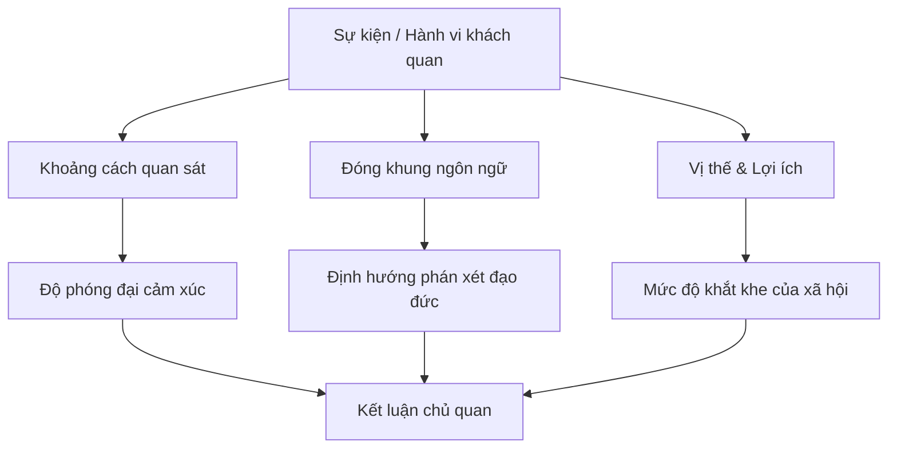

Mọi sự vật, hành vi hay biến cố không tồn tại cùng một giá trị phán xét cố định trong mắt mọi người. Cảm xúc và phán xét "đúng hay sai", "sạch hay bẩn", "đáng thương hay đáng trách" luôn bị chi phối bởi 3 trục: khoảng cách quan sát, cách thức đóng khung ngôn ngữ và vị thế lợi ích của người đánh giá.

## 1. Bản chất tâm lý của "Sạch" và "Bẩn"

"Sạch" hay "bẩn" hiếm khi là thuộc tính vật chất thuần túy, mà phần lớn là phản ứng tâm lý dựa trên mức độ chấp nhận bối cảnh và câu chuyện gắn liền với sự vật (hiệu ứng ô nhiễm tâm lý - Psychological Contamination).

Con người sẵn sàng ăn món lòng lợn dù nó từng chứa chất thải, nhưng sẽ từ chối dùng một chiếc bát ăn cơm đã tiệt trùng tuyệt đối nếu biết chiếc bát đó từng đựng phân. Ngược lại, người ta ngần ngại dùng nước rửa chân của chính mình để rửa mặt, nhưng lại thoải mái ngụp lặn trong bể bơi công cộng chứa nước ngâm hàng trăm cơ thể xa lạ.

Sự ghê sợ bắt nguồn từ liên tưởng và ký ức; khi một bối cảnh được xã hội bình thường hóa hoặc khoác lên một câu chuyện hợp thức hóa, ngưỡng chấp nhận của não bộ lập tức thay đổi.

## 2. Khoảng cách tâm lý thay đổi độ phân giải cảm xúc

Cảm xúc biến thiên theo khoảng cách và góc độ quan sát. Đứng ở tầng 1, một lời thóa mạ từ người qua đường có thể khiến ta phẫn nộ cực điểm. Lên đến tầng 10, âm thanh đó mờ nhạt như một tiếng chào vu vơ. Lên đến tầng 100, toàn bộ tiếng ồn biến mất, chỉ còn lại cảnh quan thành phố.

Hiện tượng này tương ứng với lý thuyết khoảng cách tâm lý (Construal Level Theory). Khi đứng quá gần sự việc, các chi tiết cục bộ kích hoạt cơ chế tự vệ và cảm xúc tiêu cực. Khi chủ động tạo khoảng cách về không gian, thời gian hoặc tầm nhìn nhận thức, các xung đột nhỏ nhặt mất dần trọng lượng và bị lu mờ trước mục tiêu lớn hơn.

## 3. Hiệu ứng đóng khung: Ngôn ngữ định hình phán xét

Cùng một sự việc khách quan, trật tự trần thuật và từ ngữ được lựa chọn sẽ quyết định toàn bộ phán xét đạo đức của người nghe. Ngôn ngữ không chỉ đơn thuần mô tả hiện thực mà trực tiếp đóng khung hiện thực (Framing Effect).

Việc thay đổi cấu trúc câu có thể đảo chiều vị thế từ kẻ sai trái thành nạn nhân của hoàn cảnh. Lời thừa nhận *"Tôi thích vợ người khác"* ngay lập tức kích hoạt phản ứng lên án về mặt đạo đức. Nhưng khi đổi thành *"Người tôi thích đã trở thành vợ của người khác"*, trọng tâm chuyển từ ý định tán tỉnh chủ động sang sự trớ trêu, tiếc nuối mang tính bị động, dễ gợi sự đồng cảm. Tương tự, lời mời trực diện *"Tối nay anh muốn ngủ với em"* dễ bị quy kết là thô tục, nhưng khi dịch chuyển trọng tâm sang sự gắn kết dài hạn qua câu nói *"Sáng mai anh muốn cùng em thức dậy ngắm bình minh"*, hành vi đó lại được nhìn nhận như sự lãng mạn.

Trật tự sắp xếp mệnh đề cũng thao túng điểm nhấn nhận thức cuối cùng trong tâm trí người tiếp nhận. Khi nói *"Một sinh viên ngày đi học, đêm làm tiếp viên"*, người nghe dễ đọng lại ấn tượng về sự sa ngã. Nhưng khi đảo ngược thứ tự thành *"Một tiếp viên đêm đi làm, ngày vẫn học đại học"*, ấn tượng kết lại là tinh thần vượt khó và nghị lực. Cơ chế này cũng phân biệt giữa *"Đánh mãi vẫn thua"* (bị đánh giá là bất tài, ngoan cố) và *"Thua mãi vẫn đánh"* (được nhìn nhận là kiên cường, dũng cảm). 

Sự thật không đổi, nhưng góc nhìn do ngôn ngữ kiến tạo đã biến đổi hoàn toàn cảm nhận của người tiếp nhận.

## 4. Bất đối xứng đạo đức do xung đột vị trí và lợi ích

Các tranh luận về đúng - sai trong xã hội phần lớn không xuất phát từ chân lý tuyệt đối, mà bắt nguồn từ xung đột vị thế và lợi ích kinh tế giữa các bên tham gia (Self-Serving Bias).

Người mua hàng coi mức giá cao là sự bóc lột, nhưng khi đứng ở vai người bán lại thấy khách mặc cả là ép người quá đáng. Người làm thuê xem khối lượng công việc là bóc lột sức lao động, nhưng khi ra làm chủ lại nhìn nhận sự chểnh mảng của nhân sự là thiếu trách nhiệm. Cùng một hành vi tước đoạt kế sinh nhai hoặc sinh mạng, con sói săn mồi vì đàn con bị gắn nhãn "ác thú", trong khi doanh nghiệp sa thải hàng loạt nhân sự lại được hợp thức hóa dưới mỹ từ "tối ưu hóa bộ máy".

Đạo đức luôn bị uốn nắn theo vị trí thụ hưởng; khi quyền lợi cá nhân thay đổi, trực giác phán xét tự động đảo chiều.

## 5. Tư duy định vị GPS: Tách rời sai sót khỏi cảm xúc tự trách

Khi người lái xe đi chệch khỏi hướng đã định, hệ thống định vị GPS không bao giờ bực tức, mắng mỏ hay chất vấn vì sao lại rẽ nhầm. Nó chỉ bình tĩnh thông báo: *"Đang lập lại lộ trình"*.

Tư duy này giúp ta nhìn sai lầm như một sự việc thuần túy thay vì gắn nó với cảm giác tội lỗi. Đi chệch hướng không có nghĩa là bản thân kém cỏi; đó chỉ đơn giản là phương án vừa chọn chưa mang lại kết quả như ý. Dằn vặt và đứng yên tự trách không giúp thay đổi được quá khứ. Cách phản ứng lành mạnh và thực tế nhất là cho phép mình sai, nhìn thẳng vào thực tế đang ở đâu, tính lại đường đi và tiếp tục tiến lên.

## 6. Vị thế quyết định mức độ khắt khe của xã hội

Xã hội luôn áp dụng tiêu chuẩn kép dựa trên vị thế, tài nguyên và kết quả kiểm chứng của đối tượng bị đánh giá thay vì bản thân hành vi đó.

Cùng một sai lầm hay cú sảy chân mạo hiểm, người thành đạt và giàu có được ca tụng là *"sự trải nghiệm đáng giá*", trong khi người ở tầng đáy xã hội lại bị coi là *"sự vùng vẫy vô vọng"*. Khi đang ở thế yếu, càng giải thích thì lời nói càng dễ bị xem là chống chế. Muốn người khác bớt khắt khe, cách duy nhất không phải là đi tìm sự đồng cảm bằng lời nói, mà là thay đổi vị thế bằng năng lực và kết quả thực tế. Khi vị thế thay đổi, thước đo của người đời tự khắc đổi theo.

## 7. Đúc kết hành động

Thế giới xung quanh vận hành dựa trên lăng kính tiếp nhận hơn là sự thật khách quan thuần túy. Muốn thấu hiểu và ứng xử hiệu quả với người khác, thay vì vội vàng phán xét đúng sai theo cảm tính, phản xạ đầu tiên là xác định rõ vị trí đứng, khoảng cách quan sát và quyền lợi thực tế của họ trong tình huống đó.

Đối với bản thân, cách tốt nhất để thoát khỏi áp lực phán xét hay cảm giác dằn vặt là chủ động điều chỉnh ba biến số: tạo khoảng cách tâm lý để thấy bức tranh lớn hơn, định khung lại sự việc bằng ngôn ngữ trung tính, và tập trung nâng cấp vị thế bằng hành động cụ thể thay vì tốn năng lượng giải thích lòng vòng.

## Liên kết liên quan

- [[May mắn - Lăng kính nhận thức và cơ hội]] - Cùng logic về lăng kính nhận thức, thiên kiến xác nhận và mở rộng vùng chú ý.
- [[Kỷ luật và Thói quen - Thiết kế hành vi]] - Thiết kế hệ thống hành động và môi trường thay vì phụ thuộc vào cảm xúc và ý chí tự trách.