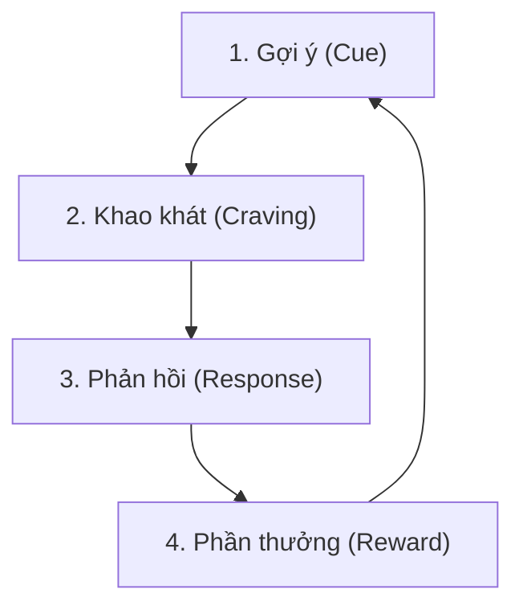
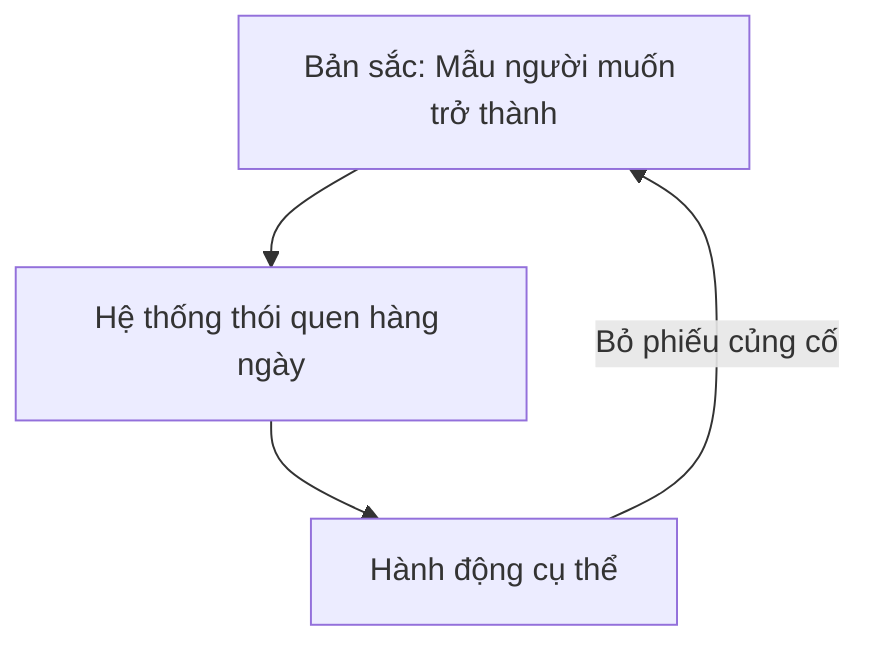

## Kỷ luật là điều kiện tiên quyết của tự do

Một hiểu lầm phổ biến là đồng nhất tự do với trạng thái muốn làm gì thì làm. Trên thực tế, khi thiếu kỷ luật, hành vi con người hoàn toàn bị điều khiển bởi quán tính bản năng, cảm xúc nhất thời, sự chi phối của môi trường hoặc kỳ vọng của người khác.

Tự do đích thực không phải là sự giải phóng khỏi mọi ràng buộc, mà là năng lực tự kiểm soát để kiên trì thực hiện những mục tiêu dài hạn đã chủ động lựa chọn. Khi đạt đến mức độ tự giác cao, kỷ luật không còn mang lại cảm giác gò bó hay hành xác, mà chuyển hóa thành trạng thái ổn định nội tâm: nhận biết rõ bản thân đang tiến bộ có kiểm soát mỗi ngày.

## Ba giai đoạn của tiến trình kỷ luật

Tiến trình hình thành kỷ luật luôn trải qua 3 giai đoạn tâm lý nối tiếp:

| Giai đoạn | Trạng thái tâm lý | Rủi ro chính | Giải pháp vượt qua |
| --- | --- | --- | --- |
| **1. Hưng phấn** | Hào hứng nhờ mục tiêu mới, kỳ vọng cao và động lực ban đầu. | Dễ nhầm lẫn cảm xúc hưng phấn nhất thời với năng lực duy trì bền bỉ. | Tập trung xây dựng quy trình tối thiểu thay vì đặt mục tiêu quá tải. |
| **2. Đau đớn** | Phải lặp lại hành động khi cảm hứng biến mất; xuất hiện lực cản sinh học. | Điểm gãy chính: phần lớn bỏ cuộc vì coi sự khó chịu là cực hình. | Nhận diện đây là giai đoạn chuyển tiếp tất yếu; giảm ma sát hành vi. |
| **3. Hưởng thụ** | Hành vi đúng trở thành phản xạ tự nhiên; xuất hiện cảm giác làm chủ cuộc sống. | Chủ quan, nới lỏng cấu trúc khi hệ thống chưa đủ vững chắc. | Duy trì hệ thống bảo vệ và gắn thói quen vào bản sắc cá nhân. |

Điểm gãy cốt lõi nằm ở giai đoạn đau đớn. Nếu coi kỷ luật là sự trừng phạt, con người sẽ dừng lại trước khi phần thưởng kịp xuất hiện. Việc hiểu rõ cơ chế chuyển tiếp giúp vô hiệu hóa cảm giác khó chịu, không coi đó là lý do để từ bỏ.

## Bản chất của kỷ luật: Năng lực làm phép trừ

Kỷ luật luôn gắn liền với sự từ bỏ có chủ đích. Để đạt được một kết quả vượt trội, con người bắt buộc phải cắt giảm những nguồn phân tâm:
- Muốn cải thiện thể chất phải cắt giảm thực phẩm siêu chế biến, thói quen thức khuya và lối sống lười vận động.
- Muốn tích lũy tri thức sâu phải từ bỏ việc tiêu thụ nội dung nhanh, game hoặc mạng xã hội vô bổ.
- Muốn xây dựng sự nghiệp vững chắc phải chấp nhận đánh đổi các cuộc vui ngắn hạn để đầu tư vào năng lực lõi.

Tâm lý học hành vi chỉ ra rằng con người chịu ảnh hưởng mạnh bởi Tâm lý né tránh mất mát (*Loss Aversion*): cảm giác đau đớn khi mất mát luôn lớn hơn niềm vui khi nhận được lợi ích tương đương. Do đó, kỷ luật trở nên khó khăn không hẳn vì bản thân hành động mới quá phức tạp, mà vì não bộ phản kháng trước việc phải từ bỏ các khoái cảm quen thuộc trước mắt. Người có bản lĩnh là người biết rõ điều gì không cần giữ, điều gì phải kiên quyết loại bỏ và điều gì nhất định phải bảo vệ bằng mọi giá.

## Chuyển đổi mô thức tư duy

Nỗ lực kỷ luật sẽ nhanh chóng sụp đổ nếu chỉ cố gắng kiểm soát thời gian hay ép buộc cơ bắp trong khi giữ nguyên mô thức tư duy cũ. Kỷ luật bền vững đòi hỏi 3 bước chuyển hóa nhận thức:
- Chuyển từ câu hỏi cảm xúc *"Mình có thích làm không?"* sang câu hỏi định hướng *"Việc này phục vụ mục tiêu dài hạn nào?"*.
- Chuyển từ tâm lý mất mát *"Mình đang phải từ bỏ điều gì?"* sang tâm lý phòng hộ *"Mình đang bảo vệ giá trị gì?"*.
- Chuyển từ phương pháp cưỡng chế *"Cố gắng gồng mình bằng ý chí"* sang phương pháp kỹ thuật *"Thiết kế hệ thống để hành vi đúng diễn ra thuận lợi nhất"*.

## Cơ chế sinh học: Não bộ không được lập trình cho kỷ luật

Về mặt tiến hóa, não bộ con người được tối ưu hóa cho mục tiêu sinh tồn tức thời thông qua hai cơ chế chính:
- **Bảo tồn năng lượng**: Luôn ưu tiên trạng thái nghỉ ngơi, trì hoãn các hoạt động tiêu tốn calo cao.
- **Tìm kiếm phần thưởng nhanh**: Ưu tiên các kích thích giải phóng dopamine ngay lập tức (như mạng xã hội, đường, nội dung ngắn) thay vì các phần thưởng dài hạn trừu tượng.

Hiện tượng thiếu kỷ luật không phải là khiếm khuyết nhân cách mà là phản ứng sinh học tự nhiên. Việc dựa hoàn toàn vào ý chí tương đương với việc chiến đấu chống lại hàng triệu năm lập trình tiến hóa. Khi năng lượng ý chí cạn kiệt (*Ego Depletion*), não bộ sẽ tự động đưa cơ thể về chế độ tự lái và chọn con đường ít lực cản nhất. Do đó, mấu chốt không phải là tăng cường ý chí mà là thay đổi thiết kế môi trường sống.

## Kiến trúc lựa chọn

Kiến trúc lựa chọn (*Choice Architecture*) là phương pháp sắp xếp môi trường vật lý và kỹ thuật số nhằm điều hướng hành vi một cách tự nhiên. Hành động thực tế của con người chịu sự chi phối bởi những gì gần nhất, dễ thấy nhất và tiện tiếp cận nhất.

Khi môi trường được tái cấu trúc để hành vi lành mạnh trở thành lựa chọn tốn ít năng lượng nhất, não bộ sẽ thực hiện mà không cần đấu tranh tâm lý:
- Tăng đọc sách: Đặt sách ngay trên bàn làm việc hoặc đầu giường thay vì cất trong tủ.
- Giảm phụ thuộc điện thoại: Bật chế độ không làm phiền, chuyển màn hình sang thang độ xám (grayscale) và để thiết bị ở phòng khác khi làm việc.
- Duy trì tập luyện: Xếp sẵn quần áo và giày tập ngay cạnh giường từ tối hôm trước.

## Xếp chồng thói quen

Xếp chồng thói quen (*Habit Stacking*) là kỹ thuật cấy ghép một hành vi mới vào chuỗi phản xạ thần kinh của một thói quen cũ đã vững chắc, dựa trên công thức:

> *"Sau khi [Thói quen hiện tại], tôi sẽ [Thói quen mới]."*

Kỹ thuật này tận dụng tín hiệu kích hoạt sẵn có trong não bộ để giảm thiểu năng lượng khởi động hành vi mới.

**Quy tắc thực thi hiệu quả:**
- **Quy tắc 2 phút**: Hành vi mới trong giai đoạn đầu chỉ nên kéo dài dưới 2 phút (ví dụ: đọc 1 trang sách, chống đẩy 2 cái).
- **Tính xác định cao**: Định nghĩa hành động cụ thể, tránh diễn đạt chung chung (dùng "ngồi vào bàn viết 50 từ" thay vì "tập viết bài").
- **Tính liền mạch**: Thực hiện ngay lập tức sau thói quen kích hoạt mà không có khoảng đệm trì hoãn.

## Bốn quy luật thay đổi hành vi 

Để kiểm soát hành vi có hệ thống, James Clear đề xuất khung 4 quy luật vận hành song song theo hai chiều:

| Quy luật | Xây dựng thói quen tốt (Tạo lập) | Phá bỏ thói quen xấu (Loại bỏ) |
| --- | --- | --- |
| **1. Tín hiệu** | **Làm cho nó rõ ràng**: Đặt các vật kích hoạt hành vi trong tầm mắt. | **Làm cho nó vô hình**: Loại bỏ hoàn toàn tín hiệu cám dỗ khỏi môi trường sống. |
| **2. Khao khát** | **Làm cho nó hấp dẫn**: Ghép việc cần làm với việc yêu thích; tham gia nhóm có chuẩn mực tương đồng. | **Làm cho nó kém hấp dẫn**: Nhận diện bản chất lãng phí và tác hại dài hạn của hành vi xấu. |
| **3. Phản hồi** | **Làm cho nó dễ dàng**: Giảm tối đa ma sát và số bước thực hiện hành vi mong muốn. | **Làm cho nó khó khăn**: Tăng tối đa ma sát (dùng ứng dụng khóa, đặt mật khẩu phức tạp, cất xa). |
| **4. Phần thưởng** | **Làm cho nó thỏa mãn**: Tạo phản hồi tích cực hoặc phần thưởng nhỏ ngay sau khi hoàn thành. | **Làm cho nó bất mãn**: Tạo hậu quả tức thì (cam kết công khai, nhờ người giám sát). |

Khi gặp tình trạng trì hoãn, cần rà soát lại hệ thống theo 4 quy luật này thay vì tự trách móc bản thân. Trì hoãn luôn là lỗi thiết kế hệ thống, không phải lỗi của ý chí.

## Thói quen dựa trên bản sắc

Thay đổi hành vi bền vững nhất diễn ra ở tầng bản sắc cốt lõi: không tập trung vào *kết quả muốn đạt được*, mà tập trung vào *mẫu người muốn trở thành*.

Mỗi hành động thực tế là một lá phiếu củng cố cho bản sắc cá nhân:
- Một buổi tập thể dục dù không có cảm hứng là một lá phiếu cho bản sắc "người chăm sóc sức khỏe".
- Một trang sách được đọc thay vì lướt mạng xã hội là một lá phiếu cho bản sắc "người học tập suốt đời".

Kỷ luật đích thực là kết quả tự nhiên khi hệ thống môi trường, thói quen vi mô và bản sắc cá nhân được thiết kế đồng bộ theo cùng một hướng.

## Khung tra cứu và tự kiểm tra

Khi một hành vi quan trọng liên tục bị trì hoãn hoặc thất bại, rà soát theo các bước:
1. **Rào cản tâm lý**: Bản thân đang sợ mất đi sự thoải mái hay khoái cảm tức thời nào?
2. **Định hướng dài hạn**: Hành vi này bảo vệ giá trị cốt lõi hay sự tự do nào trong tương lai?
3. **Kiểm tra 4 quy luật**: Tín hiệu đã đủ rõ ràng, hành động đã đủ dễ dàng (dưới 2 phút) và có phần thưởng ghi nhận tức thì chưa?
4. **Môi trường**: Ma sát xung quanh hành vi đúng đã được triệt tiêu tối đa chưa? Có thể gắn vào thói quen cũ nào?
5. **Bản sắc**: Hành động này đang bỏ phiếu cho mẫu người nào mà bản thân hướng tới?

## Liên kết liên quan

- [[May mắn - Lăng kính nhận thức và cơ hội]] - cùng mạch thiết kế nhận thức và mở rộng vùng chú ý thay vì trông chờ vào may rủi hay nỗ lực mù quáng.
- [[Góc nhìn - Nhận thức, vị thế và cách gọi tên]] - thiết kế hệ thống hành động và môi trường thay vì phụ thuộc vào cảm xúc và ý chí tự trách.