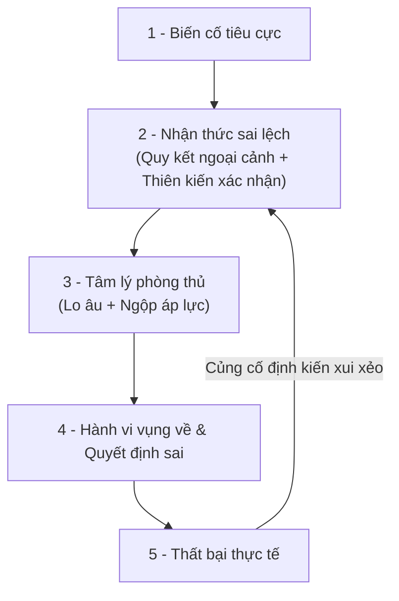
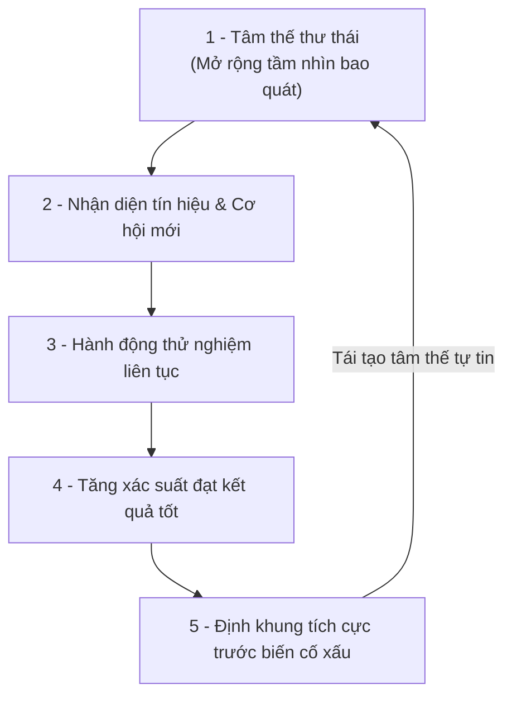

## Ý chính

May mắn không đơn thuần là phân phối xác suất khách quan, mà là sản phẩm của lăng kính nhận thức, trạng thái tâm lý và khả năng nắm bắt cơ hội trong môi trường.

Một người tự gắn nhãn xui xẻo thường bị co hẹp vùng chú ý do căng thẳng phòng thủ, dẫn đến giảm chất lượng hành vi và bỏ lỡ các tín hiệu tích cực. Ngược lại, người tin mình may mắn duy trì trạng thái thư thái, mở rộng trường quan sát ngoại vi, từ đó gia tăng tần suất phát hiện và khai thác cơ hội ngẫu nhiên.

## Vòng lặp tạo cảm giác xui xẻo

Cảm giác xui xẻo kéo dài là một vòng lặp tâm lý tự củng cố, bắt nguồn từ cách xử lý thông tin sai lệch trước các biến cố tiêu cực:

### Quy kết ngoại cảnh

Quy kết ngoại cảnh (External Attribution) là xu hướng giải thích mọi thất bại bằng các yếu tố bên ngoài: vận đen, người khác, gia đình hoặc hoàn cảnh.

Vấn đề cốt lõi không phải là ngoại cảnh không có tác động, mà là khi quy toàn bộ trách nhiệm ra bên ngoài, cá nhân tự tước bỏ khả năng tự sửa lỗi và điều chỉnh hành vi. Hành vi quy kết này gắn liền với xu hướng có điểm kiểm soát ngoại tại (External Locus of Control) theo lý thuyết của Julian Rotter - tức tin rằng số phận bị định đoạt hoàn toàn bởi các tác động bên ngoài.

Ngược lại, người có điểm kiểm soát nội tại (Internal Locus of Control) thiên về quy kết nội tại (Internal Attribution), xem thất bại là dữ liệu phản hồi để rà soát lại kỹ năng, phương pháp chuẩn bị hoặc lựa chọn chiến lược phù hợp.

### Thiên kiến xác nhận (Confirmation Bias)

Khi đã tự dán nhãn "bản thân đang xui", bộ não kích hoạt bộ lọc thiên vị: chỉ ghi nhận, phóng đại các dữ kiện tiêu cực và bỏ qua dữ kiện tích cực hoặc trung tính.

Các biến cố rời rạc trong đời sống (phỏng vấn trượt, cãi nhau, mất đồ, kẹt xe) bị gom lại thành chuỗi bằng chứng củng cố cho niềm tin xui xẻo. Nhãn dán này tự nuôi chính nó, biến một chuỗi ngẫu nhiên thành ảo tưởng về một "vận hạn có hệ thống".

### Định luật Murphy và cơ chế "tự làm hỏng việc"

Định luật Murphy (*"nếu một việc có thể xấu đi, nó sẽ xấu đi"*) trong tâm lý học thực chất là một lời tiên tri tự ứng nghiệm được kích hoạt bởi sự lo âu.

Khi một người bước vào hành động với tâm lý sợ thất bại, não bộ bị phân tán tải nhận thức để đối phó với nỗi sợ thay vì tập trung xử lý tác vụ. Trạng thái căng thẳng này thu hẹp khả năng quan sát (tunnel vision), làm chậm phản xạ và gây ngợp tâm lý (choking under pressure). Thao tác mất đi độ mượt mà tự nhiên, quyết định trở nên vụng về và dẫn đến sai sót thực tế. Biến cố xấu xảy ra không phải do "vận hạn", mà do chính áp lực tâm lý đã bẻ gãy chất lượng hành vi.

## Thí nghiệm của Richard Wiseman

Trong công trình nghiên cứu kéo dài 10 năm trên hơn 400 tình nguyện viên từ 18 đến 84 tuổi (công bố trong *The Luck Factor*, 2003), nhà tâm lý học Richard Wiseman chia người tham gia thành hai nhóm: tự nhận luôn may mắn và tự nhận luôn xui xẻo.

Ông phát cho mỗi người một tờ báo và yêu cầu đếm chính xác số lượng bức ảnh bên trong. Trên thực tế:
- Tại trang 2 của tờ báo, có một dòng chữ in khổ lớn chiếm nửa trang: *"Dừng đếm - Tờ báo này có 43 bức ảnh"*.
- Ở trang giữa, có một thông báo khổ lớn thứ hai: *"Dừng đếm, báo cho người làm thí nghiệm rằng bạn thấy thông báo này để nhận phần thưởng 250 bảng Anh"*.

Kết quả thực nghiệm ghi nhận:
- **Nhóm tự nhận may mắn**: Phát hiện dòng chữ dừng đếm chỉ sau vài giây lật báo và nhận phần thưởng ngay lập tức. Tâm lý thư thái giúp họ duy trì khả năng quét dữ liệu ngoại vi tốt.
- **Nhóm tự nhận xui xẻo**: Mất trung bình 2 phút cặm cụi đếm từng ảnh mà không hề thấy thông báo nhận tiền. Khi chỉ dồn chú ý vào một mục tiêu đơn lẻ trong trạng thái căng thẳng, họ rơi vào bẫy "mù chú ý" (*Inattentional Blindness*) và vô tình bỏ qua các cơ hội hiển hiện ngay trước mắt.

Bài học rút ra: May mắn thực chất là khả năng bao quát môi trường. Người càng biết thả lỏng tâm trí thì càng nhìn thấy nhiều lối đi mà người bận rộn, căng thẳng thường bỏ qua.

## Bốn nguyên tắc xây dựng vận may

Muốn gia tăng may mắn, trọng tâm là thay đổi cấu trúc nhận thức và thói quen hành vi để mở rộng diện tích tiếp xúc với các cơ hội ngẫu nhiên:

1. **Tăng tần suất va chạm**: Đa dạng hóa trải nghiệm và mạng lưới quan hệ; không để cuộc sống rơi vào một lịch trình đóng kín đơn điệu.
2. **Lắng nghe trực giác**: Tận dụng phản xạ nhận biết quy luật của tiềm thức, loại bỏ nỗi sợ cảm tính để chớp thời cơ dứt khoát.
3. **Kỳ vọng kết quả tốt**: Duy trì sự tự tin để thúc đẩy hành động liên tục; hành động đủ nhiều thì thời cơ thuận lợi tự khắc xuất hiện.
4. **Định khung lại thất bại**: Tìm ra phần may mắn còn lại trong biến cố xấu để chặn đứng cảm xúc tiêu cực và tập trung xử lý vấn đề thực tế.

## Năm bước tự vấn để ngắt vòng xoáy vận hạn

1. **Tách dữ liệu khỏi cảm xúc**: Đây là lỗi thực tế cần sửa hay chỉ là chuyện xui ngẫu nhiên?
2. **Xác định quyền kiểm soát**: Bỏ qua ngoại cảnh, mình thay đổi được biến số nào?
3. **Gỡ nhãn nạn nhân**: Ngừng gom biến cố rời rạc thành bằng chứng "đen đủi".
4. **Hạ nhiệt tâm lý**: Thả lỏng để tránh bị ngộp áp lực và làm hỏng việc tiếp theo.
5. **Định khung lại**: Kịch bản tồi tệ hơn là gì, và điểm sáng ở đâu?

## Liên kết liên quan

- [[Góc nhìn - Nhận thức, vị thế và cách gọi tên]] - Cùng logic về lăng kính nhận thức, thiên kiến xác nhận và kỹ thuật định khung lại sự việc.
- [[Kỷ luật và Thói quen - Thiết kế hành vi]] - Thiết kế hệ thống hành động và môi trường thay vì phụ thuộc vào cảm xúc và ý chí tự trách.