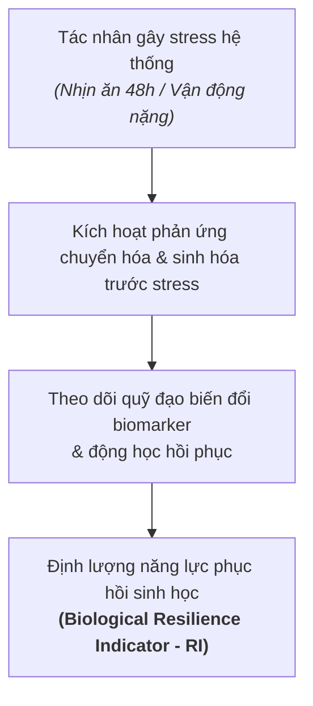

Nghiên cứu DELTA (NCT06630637) là một thử nghiệm can thiệp tiến cứu, nhãn mở (open-label) trên một cá nhân ($N=1$, đối tượng DELTA001 / tác giả [[Nghiên cứu DELTA - Bài 1. Từ câu chuyện tự thực nghiệm của Dean Ho|Dean Ho]], 45 tuổi), công bố trên tạp chí *PLOS ONE* vào tháng 8-2026. Trọng tâm của nghiên cứu là đánh giá và định lượng **khả năng phục hồi sinh học** (biological resilience) thông qua việc theo dõi quỹ đạo động học của các dấu ấn sinh học (biomarkers) trước và sau các tác nhân gây stress sinh lý chuẩn hóa (nhịn ăn, tập luyện), kết hợp can thiệp lối sống tổ hợp với các công nghệ sức khỏe số (thiết bị đeo theo dõi liên tục và trợ lý AI).

---

## 1. Khung tiếp cận: Chuyển dịch từ chỉ số tĩnh sang động học phục hồi

Khoảng cách giữa tuổi thọ (lifespan) và tuổi thọ khỏe mạnh (healthspan) đang nới rộng, với mức chênh lệch trung bình toàn cầu là 9,6 năm và tại Mỹ là 12,4 năm. Việc chuyển dịch từ mô hình "chăm sóc khi phát bệnh" (sick care) sang "chăm sóc phòng ngừa chủ động" (well care) gặp rào cản lớn do y tế truyền thống phụ thuộc chủ yếu vào các chỉ số chụp nhanh định kỳ hàng năm (như bộ mỡ máu tĩnh). 

Các chỉ số tĩnh này bỏ lỡ khả năng thích ứng động của cơ thể. Trong khi các nghiệm pháp gắng sức lâm sàng cổ điển (như nghiệm pháp dung nạp glucose đường uống OGTT hay stress test tim mạch) chỉ thăm dò một con đường chức năng đơn lẻ bằng cơ chất ngoại sinh, giao thức DELTA sử dụng các tác nhân gây stress hệ thống (nhịn ăn 48 giờ, bài tập kháng lực) để kích hoạt sự chuyển dịch sử dụng năng lượng nội sinh trên nhiều con đường chức năng đồng thời.

---

## 2. Giao thức can thiệp tổ hợp DELTA

Giao thức can thiệp DELTA bao gồm 5 trụ cột chính được thực hiện đồng thời nhằm đưa các dấu ấn sinh học vào trạng thái linh động để quan sát phản ứng:

| Trụ cột                      | Chi tiết giao thức can thiệp                                                                                                                                                                                                         | Mục tiêu sinh học                                                                                          |
| ---------------------------- | ------------------------------------------------------------------------------------------------------------------------------------------------------------------------------------------------------------------------------------ | ---------------------------------------------------------------------------------------------------------- |
| **Nhịn ăn gián đoạn (TRE)**  | Khung ăn 4 giờ (11:00 - 15:00), nhịn ăn tối thiểu 20 giờ mỗi ngày; định kỳ thực hiện các đợt nhịn nước hoàn toàn 48 giờ (chỉ uống nước, không calo, không thực phẩm bổ sung).                                                        | Hoàn tất tiêu hóa trước khi ngủ; kích hoạt chuyển đổi chuyển hóa sang thể ketone; tạo tác nhân gây stress. |
| **Vận động thể lực**         | Tập sức mạnh hàng ngày (chia theo 1 nhóm cơ chính mỗi ngày) ở mức vừa đến nặng; kết hợp chạy ngắt quãng cường độ cao (Norwegian HIIT 4x4) 2–3 buổi mỗi tuần.                                                                         | Duy trì khối cơ nạc, kích thích tiêu thụ cơ chất đường phân khẩn cấp và cải thiện sức bền tim mạch.        |
| **Dinh dưỡng Địa Trung Hải** | 100% dầu olive nguyên chất (EVOO); đạm nạc (cá, gà, đậu gà); salad bắp cải đỏ; sinh tố polyphenol (việt quất, bông cải xanh, bắp cải đỏ, gừng); pudding hạt (hạt chia, hạt lanh, vỏ mã đề, bột cacao nguyên chất, đường la hán quả). | Giảm tải viêm mạn tính, cung cấp chất chống oxy hóa và tối ưu nguồn chất xơ cho hệ vi sinh.                |
| **Tái cấu trúc giấc ngủ**    | Dịch chuyển giờ ngủ sớm hơn 2,5–2,75 giờ (lên giường 21:15, ngủ trước 21:45, thức 5:45–6:00); dừng caffeine từ 7:00 (ngày thường) hoặc 8:00 (cuối tuần); loại bỏ ngủ trưa; không dùng màn hình trước khi ngủ; ngủ phòng riêng.       | Cân bằng nhịp sinh học, tối ưu hóa giấc ngủ sóng chậm (SWS) và giai đoạn ngủ REM.                          |
| **Giám sát số & Biomarker**  | Thiết bị đeo liên tục (Apple Watch 9, Garmin Epix Pro 2, WHOOP 4.0); que thử mao mạch glucose/ketone (Abbott Optium Neo); CGM (Abbott Freestyle Libre); xét nghiệm máu chuẩn phòng lab; giải trình tự 16S rRNA phân (AMILI).         | Thu thập chuỗi dữ liệu thời gian thực và đo lường biến động sinh học đa tầng.                              |

---

## 3. Động học chuyển hóa và độ linh hoạt sinh học

### Động học Glucose - Ketone khi chịu tải thể lực

Khi DELTA001 đã ở trạng thái ketosis sâu (sau 40–42 giờ nhịn ăn), một buổi tập nâng tạ được thực hiện kèm việc lấy mẫu máu liên tục mỗi 5–20 phút:

1. **Giai đoạn 1 (Khởi phát đường phân - Glycolytic onset):** Ngay khi bắt đầu nâng tạ, lượng glucose trong máu tăng vọt và mức ketone giảm nhanh chóng. Hiện tượng này phản ánh sự chuyển dịch cơ chất khẩn cấp sang tân tạo đường (tại gan) và đường phân (tại cơ) nhằm cung cấp năng lượng tức thời cho vận động.
2. **Giai đoạn 2 & 3 (Hồi phục ketosis - Ketotic recovery):** Sau khi ngừng tập, nồng độ ketone bật tăng trở lại theo quỹ đạo hàm đa thức bậc hai, tăng liên tục trong khoảng 100 phút trước khi đạt trạng thái bình nguyên.
3. **Động học chuyển đổi bất đối xứng:** Tốc độ tụt ketone khi vận động nặng luôn lớn hơn tốc độ hồi phục ketone sau tập. Cả ba thông số: *Tốc độ khởi phát đường phân*, *Tốc độ phục hồi ketosis* và *Tổng tốc độ chuyển đổi cơ chất* đều tương quan thuận theo liều lượng với thời gian tập luyện.

### Tốc độ vào trạng thái Ketosis sau bữa ăn

Trong chế độ ăn một bữa mỗi ngày (OMAD), thời gian cần thiết để cơ thể chuyển từ trạng thái sau ăn sang ketosis (nồng độ ketone trong máu $\ge 0{,}5\ \text{mmol/L}$) rút ngắn từ hơn 20 giờ xuống còn 16,5 giờ sau chuỗi ngày thích nghi, cho thấy sự cải thiện rõ rệt về độ linh hoạt chuyển hóa (metabolic switching).

---

## 4. Quỹ đạo các Biomarker Tim mạch và Đa hiệu

Nghiên cứu khảo sát các chỉ số máu tại 3 trạng thái: trước nhịn 48h (PRE48), sau nhịn 48h (POST48) và sau khi ăn lại 2–3 ngày (POST-RF), đối chiếu với chế độ ăn 3 bữa thông thường (3MAD - Three Meals A Day).

### Apolipoprotein (ApoB, ApoA và tỷ lệ ApoB/ApoA)

ApoB phản ánh trực tiếp số lượng hạt lipoprotein sinh xơ vữa (chính xác hơn LDL-C), trong khi ApoA phản ánh chức năng bảo vệ tim mạch của HDL.

- **Biến động khi nhịn:** Mức ApoB trước nhịn là $75 \pm 3{,}9\ \text{mg/dL}$. Sau 48 giờ nhịn ăn, ApoB tăng lên $84 \pm 3{,}1\ \text{mg/dL}$. 
- **Bản chất sinh lý:** Sự gia tăng ApoB sau nhịn ăn không mang tính bệnh lý mà xuất phát từ việc cơ thể tăng cường huy động lipid dự trữ từ mô mỡ vào máu để phục vụ quá trình oxy hóa chất béo khi cạn kiệt glycogen.
- **Khả năng thanh thải lipoprotein:** Khi ăn lại hoặc ở chế độ 3 bữa (3MAD), ApoB giảm nhanh về mức $65 - 74\ \text{mg/dL}$. Sự sụt giảm này chứng minh khả năng thanh thải lipoprotein hiệu quả và độ nhạy insulin cao của tế bào, vì quá trình dị hóa ApoB phụ thuộc chặt chẽ vào tín hiệu insulin. Tỷ lệ ApoB/ApoA duy trì ở ngưỡng tối ưu ($0{,}41 - 0{,}48$).

### Protein phản ứng C độ nhạy cao (hs-CRP)

hs-CRP là chỉ số phản ánh tình trạng viêm hệ thống, tình trạng viêm mạn tính liên quan đến lão hóa (inflammaging) và nguy cơ tim mạch.

- Nồng độ hs-CRP của DELTA001 duy trì liên tục ở mức rất thấp ($0{,}23 - 0{,}41\ \text{mg/L}$), thấp hơn nhiều so với ngưỡng rủi ro thấp chuẩn lâm sàng ($< 1{,}0\ \text{mg/L}$) và mức trung bình $1{,}24\ \text{mg/L}$ của nam giới cùng độ tuổi trong các nghiên cứu dân số.
- Sau 48 giờ nhịn ăn, nồng độ hs-CRP không tăng (PRE48: $0{,}41\ \text{mg/L} \rightarrow$ POST48: $0{,}28\ \text{mg/L}$), cho thấy cơ thể không kích hoạt phản ứng viêm bất lợi trước căng thẳng chuyển hóa cấp tính.

### Homocysteine và Chỉ số phục hồi sinh học (Resilience Indicator)

Homocysteine là chỉ số phản ánh trạng thái con đường methyl hóa, dự trữ vitamin nhóm B, cũng như nguy cơ lão hóa thần kinh và tim mạch.

- **Chu kỳ 1:** Sau 48 giờ nhịn ăn lần đầu, homocysteine tăng vọt từ $6{,}6\ \mu\text{mol/L}$ lên $13{,}2\ \mu\text{mol/L}$ (vượt ngưỡng tối ưu $10\ \mu\text{mol/L}$), nhưng nhanh chóng trở về mức cơ bản sau 2–3 ngày ăn lại ($7{,}4\ \mu\text{mol/L}$).
- **Chu kỳ 2 và 3:** Hiện tượng thích nghi methyl hóa xuất hiện rõ rệt. Mức tăng sau nhịn bị triệt tiêu hoàn toàn (POST48 chỉ còn $7{,}7\ \mu\text{mol/L}$ ở chu kỳ 2 và $8{,}0\ \mu\text{mol/L}$ ở chu kỳ 3). Mức nền duy trì ổn định ở khoảng $5{,}0 - 6{,}1\ \mu\text{mol/L}$ (ngưỡng tối ưu vượt trội "elite", rất hiếm gặp ở độ tuổi trung niên theo nghiên cứu Framingham).
- **Định lượng diện tích dưới đường cong (AUC) và Chỉ số phục hồi (RI):**
  - Diện tích dưới đường cong nồng độ homocysteine theo thời gian giảm dần qua các chu kỳ: $45{,}4 \rightarrow 31{,}5 \rightarrow 27{,}9\ \mu\text{mol}\cdot\text{day/L}$.
  - Chỉ số phục hồi (Resilience Indicator - RI) được tính toán theo công thức:
    $$\text{RI} = D \times 15 - \text{AUC}_{\text{homocysteine}}$$
    *(Trong đó $D$ là tổng số ngày quan sát, hằng số 15 $\mu\text{mol/L}$ là giới hạn lâm sàng trên của homocysteine bình thường).*
  - Giá trị RI tăng liên tục qua 3 chu kỳ: $22{,}1 \rightarrow 28{,}5 \rightarrow 32{,}1\ \mu\text{mol}\cdot\text{day/L}$, phản ánh khả năng đệm giảm chấn trước tác nhân gây stress và sự hình thành năng lực phục hồi methyl hóa bền vững.

---

## 5. Tái cấu trúc giấc ngủ và Thích ứng nhịp sinh học

### Cải thiện kiến trúc giấc ngủ

So sánh giữa dữ liệu giai đoạn hồi cứu (RETRO - Q1/2024, đi ngủ lúc 00:00) và giai đoạn can thiệp (đầu can thiệp START & cuối can thiệp END, đi ngủ lúc 21:15) ghi nhận qua thiết bị đeo:

| Giai đoạn ngủ | Hồi cứu (RETRO) | Bắt đầu can thiệp (START) | Kết thúc can thiệp (END) | Mức độ thay đổi |
|---|---|---|---|---|
| **Tổng thời gian ngủ** | $372{,}3 \pm 12{,}3$ phút | $454{,}6 \pm 8{,}2$ phút | $493{,}3 \pm 5{,}0$ phút | Tăng ~2 giờ ngủ thực tế mỗi đêm |
| **Giấc ngủ sâu (sóng chậm - SWS)** | $28{,}9 \pm 1{,}8$ phút | $43{,}0 \pm 2{,}5$ phút | $43{,}3 \pm 2{,}9$ phút | Tăng gần 50% thời lượng sóng chậm |
| **Giấc ngủ REM** | $65{,}2 \pm 2{,}7$ phút | $90{,}6 \pm 4{,}5$ phút | $108{,}0 \pm 4{,}8$ phút | Tăng 65%, củng cố trí nhớ và nhận thức |
| **Giấc ngủ nông (Light sleep)** | $286{,}7 \pm 8{,}3$ phút | $324{,}4 \pm 6{,}4$ phút | $341{,}6 \pm 5{,}7$ phút | Tăng tỷ lệ thuận theo tổng thời gian |
| **Thời gian thức trong đêm** | $26{,}6 \pm 3{,}5$ phút | $19{,}2 \pm 3{,}7$ phút | $13{,}2 \pm 1{,}4$ phút | Giảm 50%, giấc ngủ liền mạch hơn |

Cơ chế cải thiện bắt nguồn từ việc phối hợp ngủ sớm (tăng tiết melatonin sớm, tăng hoạt tính phó giao cảm ban đêm), tập thể dục sáng (tăng cường trương lực phó giao cảm buổi tối) và kết thúc ăn trước 15:00 (tránh gánh nặng tiêu hóa ảnh hưởng đến chu kỳ sinh học).

### Khả năng thích ứng khi di chuyển quốc tế

Trong các chuyến công tác qua nhiều múi giờ (Singapore, Maroc, Thổ Nhĩ Kỳ, Úc, Ấn Độ, Mỹ, Bồ Đào Nha), kiến trúc giấc ngủ và độ biến thiên nhịp tim (HRV) vẫn được bảo toàn tốt nhờ quy trình:
- Ưu tiên chuyến bay đêm đường dài; ngủ ngay sau khi cất cánh với bịt mắt và nút tai.
- Dồn bữa ăn trên máy bay về sát thời điểm hạ cánh; nếu đến nơi vào buổi sáng thì ăn đủ calo và không ăn thêm trong ngày để khớp lại khung ăn 11:00 - 15:00.
- Khởi động lại bài tập thể lực sáng ngay tại điểm đến.
- Gián đoạn giấc ngủ và sụt giảm HRV chỉ xuất hiện ở các chuyến bay đêm ngắn (dưới 4 giờ) do thời lượng dành cho giấc ngủ bị rút ngắn, chứ không phải do tác động của việc lệch múi giờ.

---

## 6. Động học Hệ vi sinh đường ruột (Microbiome)

Giải trình tự gen 16S rRNA từ các mẫu phân thu thập qua các điều kiện nhịn ăn 48h và ăn 3 bữa ghi nhận:

1. **Tính bền vững của hệ vi sinh:** Nhịn ăn 48 giờ không gây xáo trộn đáng kể về tỷ lệ các ngành vi khuẩn chính (*Actinobacteria*, *Bacteroidetes*, *Firmicutes*, *Proteobacteria*), tỷ lệ $F/B$ cũng như độ đa dạng alpha (chỉ số Shannon, Chao1, Inverse Simpson).
2. **Sự vắng mặt của *Fusobacteria*:** Chi vi khuẩn liên quan đến bệnh lý viêm đường ruột, ung thư đại trực tràng và rối loạn chuyển hóa đường hoàn toàn không xuất hiện trong tất cả các mẫu ở mọi thời điểm.
3. **Kích hoạt con đường tái sinh chuyển hóa (Metabolic Salvage Pathways):** Phân tích PICRUSt2 dự đoán sự gia tăng biểu hiện/hoạt hóa đáng kể ($p \le 0{,}05$) của 2 con đường:
   - **PWY-5532:** Con đường tái sinh của vi khuẩn cổ (Archaea) nhằm tái chế nucleoside và bazơ nitơ thành đường phosphat, tạo ra 3-phospho-D-glycerat (G3P) để cấp nguyên liệu cho chu trình đường phân khi nguồn carbohydrate từ thức ăn bị cắt đứt.
   - **PWY490-3:** Con đường khử nitrat đồng hóa, chuyển nitrat thành amoniac để cung cấp nitơ tổng hợp glutamat và glutamin (nguyên liệu tạo axit amin cho vi khuẩn), đồng thời kéo nitrat ra khỏi các phản ứng tạo nitrosamine gây oxy hóa.
   - Hai con đường này đóng vai trò cơ chế bù trừ thích nghi, giúp hệ vi sinh tự bảo toàn năng lượng và duy trì cân bằng nội môi với vật chủ khi bị bỏ đói dinh dưỡng.

---

## 7. Trợ lý AI, Cơ chế phản hồi và Tuổi sinh học

### Vòng lặp phản hồi dữ liệu (Data Feedback Loops)

Phỏng vấn định tính bán cấu trúc qua 3 mốc thời gian cho thấy việc người tham gia trực tiếp nhìn thấy dữ liệu thời gian thực (từ que thử và thiết bị đeo) hoạt động như một cơ chế **game hóa** (gamification). Bản thân việc theo dõi dữ liệu đã đóng vai trò như một yếu tố can thiệp hành vi độc lập:
- Nhìn thấy tốc độ vào ketosis giúp kiểm soát chặt chẽ lượng tinh bột tiêu thụ.
- Nhìn thấy biến động homocysteine thúc đẩy việc duy trì bổ sung đều đặn vitamin nhóm B.
- Mục tiêu "khép kín các vòng hoạt động thể lực" (Activity Rings trên Apple Watch) và duy trì điểm số giấc ngủ $\ge 80$ củng cố tính tự giác duy trì kỷ luật dài hạn.

### Trợ lý Healthspan Copilot & Ước tính tuổi sinh học

Hệ thống GPT tùy chỉnh được tích hợp mô hình hồi quy bình phương tối thiểu (OLS) xây dựng từ tập dữ liệu dân số NHANES, dựa trên 10 biến số lâm sàng đầu vào của DELTA001 (HbA1c 4,6%, cân nặng 74 kg, vòng eo 73,7 cm, hs-CRP 0,28 mg/L, HDL 65 mg/dL, huyết áp 109/63 mmHg, nhịp tim 57 bpm, giới tính nam, tuổi thực 45):
- Mô hình ước tính tuổi sinh học của DELTA001 đạt **31,8 tuổi** tại thời điểm tháng 4-2025 (trẻ hơn 13,2 năm so với tuổi thực 45).
- Nghiên cứu nhấn mạnh đây chỉ là mô hình mang tính gợi mở giả thuyết và là công cụ hỗ trợ duy trì thói quen, không phải thước đo trẻ hóa có giá trị chẩn đoán y khoa độc lập.

---

## 8. Giới hạn phương pháp luận khi diễn giải

1. **Thiết kế một cá nhân ($N=1$):** Không thể suy rộng kết quả cho toàn bộ dân số hoặc coi quy trình là tối ưu cho người khác.
2. **Đối tượng đồng thời là nghiên cứu viên chính:** Đối tượng ý thức rõ việc mình đang được theo dõi liên tục nên tự động điều chỉnh hành vi kỷ luật hơn bình thường (hiệu ứng Hawthorne); đồng thời nghiên cứu hoàn toàn không có nhóm đối chứng mù.
3. **Can thiệp tổ hợp đa tầng:** Nhiều can thiệp diễn ra đồng thời (nhịn ăn, ăn Địa Trung Hải, thực phẩm bổ sung, tập luyện, ngủ sớm, thiết bị đeo) nên không thể bóc tách mức độ đóng góp riêng rẽ của từng yếu tố.
4. **Điểm nền đã qua can thiệp:** Đối tượng đã quen với nhịn ăn và rèn luyện thể lực từ trước nghiên cứu; thiếu một điểm nền hoàn toàn chưa can thiệp để làm đối chứng.
5. **Nhiễu trong so sánh giấc ngủ:** Dữ liệu hồi cứu và can thiệp khác nhau về mùa, áp lực công việc và lịch sinh hoạt; phân tích so sánh trung bình giai đoạn chưa mô hình hóa chuỗi thời gian liên tục (như mô hình ARIMA).
6. **Ngưỡng phân loại chỉ số sinh học chưa được chuẩn hóa:** Các phân loại "elite", "optimal" và chỉ số phục hồi (RI) là khái niệm thăm dò, chưa phải chuẩn lâm sàng quốc tế.
7. **Hệ vi sinh thiếu dữ liệu nền dài hạn:** Giai đoạn đối chứng 3 tuần ăn bình thường (3MAD) là quá ngắn để đại diện cho một trạng thái vi sinh đường ruột ổn định; ngoài ra các con đường chuyển hóa chỉ là kết quả suy đoán tin sinh học từ phần mềm PICRUSt2 chứ chưa được định lượng sinh hóa trực tiếp.
8. **Quy trình không dành để sao chép:** Nhịn ăn 48 giờ, cường độ tập nặng và thực phẩm bổ sung được thiết kế riêng cho DELTA001. Nhịn ăn sâu không phù hợp với tất cả mọi người.
9. **Rủi ro theo dõi xâm lấn dày đặc:** Việc lấy mẫu máu quá dày đặc tiềm ẩn nguy cơ thiếu máu và gây tâm lý lo âu do theo dõi quá mức (over-monitoring). Nghiên cứu tuân thủ giới hạn an toàn: tối đa $10{,}5\ \text{mL/kg}$ hoặc $550\ \text{mL}$ trong mỗi chu kỳ 8 tuần.
10. **Xung đột lợi ích tiềm năng:** Một số tác giả là đồng sở hữu các bằng sáng chế về dấu ấn phục hồi kỹ thuật số, nền tảng tối ưu sức khỏe và AI Copilot; đồng thời giữ vai trò cố vấn/sáng lập tại một số doanh nghiệp y tế số (KYAN, AMILI, Elyx...).

---

## 9. Kết luận tra cứu nhanh

- **DELTA đã chứng minh quy trình làm tăng tuổi thọ khỏe mạnh chưa?** Chưa. Nghiên cứu chỉ chứng minh quy trình có thể duy trì bền vững trên cá nhân DELTA001 và cung cấp dữ liệu thăm dò có giá trị tạo giả thuyết.
- **Kết quả thực nghiệm vững chắc nhất là gì?** Khả năng đo lường lặp lại chu kỳ đáp ứng - phục hồi của glucose, ketone và homocysteine trước các tác nhân gây stress chuẩn hóa (nhịn ăn, tập nặng); cùng xu hướng cải thiện cấu trúc giấc ngủ bền vững suốt 7 tháng.
- **Điểm mới cốt lõi về phương pháp luận là gì?** Chuyển từ việc đánh giá giá trị tuyệt đối tại một thời điểm tĩnh sang đo lường biên độ lệch nền và tốc độ phục hồi sinh học như một dấu ấn độc lập.
- **Có thể áp dụng nguyên văn quy trình DELTA cho người khác không?** Không. Đây là giao thức cá nhân hóa cường độ cao, cần điều chỉnh theo thể trạng và có chỉ định y khoa.
- **Healthspan Copilot có phải công cụ chẩn đoán y tế không?** Không. Đây là mô hình thử nghiệm ý tưởng (proof of concept) nhằm tạo động lực và hỗ trợ tuân thủ hành vi thông qua phản hồi dữ liệu.

---

## Liên kết liên quan

- [Bài báo nghiên cứu DELTA trên PLOS ONE](https://journals.plos.org/plosone/article?id=10.1371/journal.pone.0354234): Wang P, Foo N, Su C, Leung NYT, Song SW, Seres G, et al. (2026) *DELTA: Strengthening human biological resilience with an N=1 digital health and dynamic biomarker protocol*. PLOS ONE 21(8): e0354234. 
- [[Nghiên cứu DELTA - Bài 1. Từ câu chuyện tự thực nghiệm của Dean Ho]]: Ghi chép hành trình thực nghiệm cá nhân và góc nhìn truyền thông đại chúng của tác giả Dean Ho.
- [[Nghiên cứu DELTA - Bài 3. Thẩm định sự thật khoa học đằng sau con số trẻ hơn 15 tuổi]]: Báo cáo kiểm toán khoa học đa tầng và bóc tách suy luận truyền thông toàn diện về nghiên cứu DELTA.
