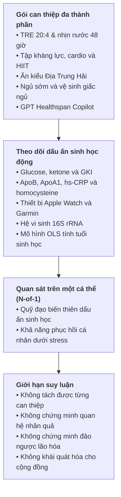
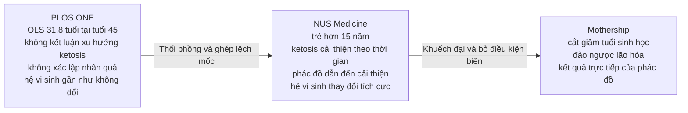

[[Nghiên cứu DELTA - Bài 2. Bức tranh động học biomarker và năng lực phục hồi sinh học|DELTA]] là thử nghiệm nhãn mở trên một cá thể (N-of-1), trong đó Giáo sư [[Nghiên cứu DELTA - Bài 1. Từ câu chuyện tự thực nghiệm của Dean Ho|Dean Ho]] vừa tham gia nghiên cứu vừa là đối tượng DELTA001. Giá trị chính của nghiên cứu nằm ở việc chứng minh tính khả thi khi theo dõi liên tục các dấu ấn sinh học động (biomarker) ở tần suất cao, trong bối cảnh cá nhân trải qua các tác nhân gây căng thẳng sinh lý có kiểm soát. Thiết kế này tạo ra dữ liệu cá nhân chi tiết, nhưng không chứng minh phác đồ đảo ngược lão hóa, kéo dài tuổi thọ hoặc phù hợp với cộng đồng.

Sự sai lệch truyền thông hình thành khi thông cáo từ NUS Medicine nâng tầm các số liệu quan sát và kết quả thuật toán thành kết luận sức khỏe, sau đó Mothership tiếp tục khuếch đại bằng những tuyên bố mang tính nhân quả về việc 'đảo ngược lão hóa'. Trường hợp DELTA cho thấy một phát ngôn có thể bắt đầu từ phép đo đúng nhưng bị bóp méo khi bị thổi phồng qua từng tầng suy luận: từ quan sát, tương quan, sang nhân quả, trẻ hóa và kéo dài tuổi thọ mà không hề có bằng chứng đi kèm.

## 1. Kết luận thẩm định cốt lõi

### DELTA cho thấy

- Có thể theo dõi quỹ đạo glucose, ketone, ApoB, hs-CRP, homocysteine, giấc ngủ và hệ vi sinh của một cá nhân qua nhiều trạng thái sinh lý.
- DELTA001 duy trì hồ sơ tim mạch và chuyển hóa thuận lợi trong thời gian quan sát: ApoB nền khoảng 75 mg/dL, hs-CRP dưới 0,5 mg/L và huyết áp ổn định.
- Dữ liệu từ thiết bị đeo cho thấy thời lượng ngủ tăng từ 6,21 giờ lên 8,22 giờ mỗi đêm khi dời lịch ngủ sớm hơn.
- Năm chu kỳ OMAD ghi nhận thời gian vào ketosis từ 16 giờ 34 phút đến 21 giờ 59 phút.
- Các đợt nhịn nước 48 giờ kết hợp tập luyện tạo ra những dữ liệu định lượng rõ nét về sự chuyển dịch nguồn năng lượng và tốc độ phục hồi của các dấu ấn sinh học.

### DELTA không chứng minh

- Phác đồ DELTA hoặc một thành phần cụ thể là nguyên nhân của các thay đổi quan sát được.
- Tốc độ vào ketosis cải thiện đều đặn theo thời gian.
- Điểm số 31,8 tuổi thể hiện sự đảo ngược lão hóa của tế bào, mô hoặc cơ quan.
- Nhịn ăn 20:4 hay nhịn nước 48 giờ kéo dài tuổi thọ ở người.
- Hệ vi sinh của DELTA001 đã được tối ưu hóa nhờ phác đồ.
- Phác đồ có thể áp dụng an toàn hoặc hiệu quả cho cộng đồng.

## 2. Khung thẩm định và thuật ngữ

Quá trình thẩm định đối chiếu ba tầng tài liệu theo thứ bậc chứng cứ:

1. **Bản ghi khoa học sơ cấp:** Bài báo Wang et al. trên PLOS ONE, công bố ngày 12-08-2026, kèm lịch sử bình duyệt và dữ liệu bổ sung.
2. **Truyền thông thể chế:** Thông cáo của NUS Medicine phát hành ngày 13-08-2026.
3. **Truyền thông đại chúng:** Bài viết của Mothership phát hành ngày 15-08-2026.

| Thuật ngữ                           | Nghĩa trong DELTA                                                                                         | Giới hạn cần nhớ                                                                   |
| ----------------------------------- | --------------------------------------------------------------------------------------------------------- | ---------------------------------------------------------------------------------- |
| **N-of-1**                          | Theo dõi lặp lại nhiều lần trên một đối tượng duy nhất.                                                   | Tạo dữ liệu cá nhân dày đặc nhưng không tự cho phép khái quát hóa.                 |
| **Nhãn mở**                         | Người tham gia và nhóm nghiên cứu biết rõ can thiệp.                                                      | Làm tăng nguy cơ sai lệch kỳ vọng; ở DELTA, nhà nghiên cứu đồng thời là đối tượng. |
| **Tiến cứu và hồi cứu**             | Dữ liệu chủ động thu thập theo thời gian thực (tiến cứu) so với dữ liệu cũ được trích xuất lại (hồi cứu). | Dữ liệu ngủ nền Q1/2024 là hồi cứu, không phải đối chứng ngẫu nhiên chuẩn hóa.     |
| **Khả năng phục hồi sinh học động** | Cách biomarker dịch chuyển và quay về cân bằng sau một tác nhân gây stress.                               | Mô hình mới ở mức thăm dò, chưa phải chỉ số tiên lượng lâm sàng chuẩn hóa.         |
| **Chuyển đổi chuyển hóa**           | Chuyển nguồn năng lượng từ glucose và glycogen sang oxy hóa mỡ và tạo ketone.                             | Thời gian vào ketosis không tự phản ánh sức khỏe, tuổi sinh học hay tuổi thọ.      |
| **Tuổi sinh học**                   | Điểm số do mô hình tính từ tập biomarker tại một thời điểm.                                               | Không phải phép đo trực tiếp mức lão hóa của toàn cơ thể.                          |
| **Nhân quả**                        | Can thiệp thực sự tạo ra thay đổi quan sát được.                                                          | Không thể suy ra chỉ vì thay đổi xảy ra sau can thiệp.                             |
| **Khả năng khái quát hóa**          | Kết quả có thể áp dụng cho nhóm người khác.                                                               | Không thể xác lập từ một cá nhân được cá thể hóa cao.                              |

## 3. Niên biểu: Can thiệp DELTA thực chất bắt đầu từ khi nào?

Niên biểu thực tế cho thấy phần lớn các thói quen cốt lõi (nhịn ăn, tập luyện, đổi chế độ ăn) đều đã được thực hành từ trước DELTA. Do đó, kết quả sức khỏe phản ánh cả một quá trình tích lũy dài hạn từ năm 2021 cộng hưởng với giai đoạn theo dõi chính thức, chứ không thể quy kết toàn bộ cho riêng thời gian thử nghiệm.

| Mốc thời gian              | Sự kiện                                                                                       | Ý nghĩa thẩm định                                                                                                |
| -------------------------- | --------------------------------------------------------------------------------------------- | ---------------------------------------------------------------------------------------------------------------- |
| Trước 2021                 | Ăn nhiều đồ ngọt và đồ chiên, ngủ không quá 5 giờ, cân nặng từng trên 90 kg.                  | Lịch sử tự thuật, không nằm trong bài PLOS ONE.                                                                  |
| 09/2021                    | Tự mua thiết bị đo đường huyết và bắt đầu thay đổi chế độ ăn, nhịn ăn, tập luyện.             | Bước ngoặt cá nhân có trước DELTA.                                                                               |
| 05/2023                    | Thực hành TRE 20:4, tập khi nhịn, ăn giàu đạm và ít carbohydrate; theo dõi glucose và ketone. | Can thiệp đã định hình trước nghiên cứu chính thức.                                                              |
| 11-22/07/2023              | Chuỗi 12 ngày nhịn ăn gián đoạn; đạt ketosis vào ngày thứ 6.                                  | Tiền lệ trực tiếp của phương pháp DELTA.                                                                         |
| 05-08/09/2023              | Nhịn nước 72 giờ; cân nặng giảm từ khoảng 82 kg xuống 75 kg.                                  | Phần lớn quá trình giảm cân diễn ra trước DELTA.                                                                 |
| 06/09-08/10/2023           | Theo dõi ketosis theo chiều dọc.                                                              | Tiền lệ phương pháp luận của nghiên cứu.                                                                         |
| 10-11/2023                 | Thêm một đợt nhịn nước 72 giờ.                                                                | Can thiệp đã tồn tại trước thử nghiệm.                                                                           |
| Q1/2024                    | Apple Watch ghi nhận trung bình 6,21 giờ ngủ mỗi đêm.                                         | Baseline hồi cứu, được truy xuất sau đó; không phải baseline ngẫu nhiên.                                         |
| Giữa 08/2024               | Bắt đầu thu dữ liệu thiết bị đeo và dời giờ ngủ về khoảng 21:15.                              | Khởi đầu giai đoạn theo dõi số chính thức.                                                                       |
| 20/09, 10/10 và 25/10/2024 | Ba thử thách nhịn nước 48 giờ kết hợp tập kháng lực.                                          | Đợt ngày 20/09 diễn ra trước ngày bắt đầu chính thức theo đăng ký.                                               |
| 30/09/2024                 | Nộp đăng ký lên ClinicalTrials.gov.                                                           | Mốc hành chính của thử nghiệm NCT06630637.                                                                       |
| 07/10/2024                 | Bắt đầu thử nghiệm chính thức với DELTA001, 45 tuổi.                                          | Mốc bắt đầu theo hồ sơ đăng ký.                                                                                  |
| 27/10/2024-04/02/2025      | Năm chu kỳ OMAD: 21:59, 21:20, 18:13, 19:20 và 16:34 để đạt ketosis.                          | Chuỗi không đơn điệu (non-monotonic); chu kỳ thứ tư chậm hơn chu kỳ thứ ba.                                      |
| 04/2025                    | Mười chỉ số lâm sàng được đưa vào mô hình OLS; đầu ra là 31,8 tuổi khi tuổi thực là 45.       | Tiêu chí đánh giá thăm dò, chỉ có một thời điểm đo.                                                              |
| 07/06/2025                 | Hoàn thành tiêu chí đánh giá chính.                                                           | Hồ sơ đăng ký thử nghiệm.                                                                                        |
| 02/07/2025                 | Hoàn thành toàn bộ nghiên cứu; trạng thái chuyển thành Completed.                             | Mâu thuẫn với thông cáo năm 2026 nói nghiên cứu vẫn tiếp diễn.                                                   |
| 10/12/2025                 | PLOS ONE tiếp nhận bản thảo.                                                                  | Bắt đầu quy trình công bố.                                                                                       |
| 04-07/2026                 | Hai vòng bình duyệt yêu cầu giảm suy luận quá mức; bài được chấp nhận trong tháng 07/2026.    | Bản báo cáo chính thức đã được gạn lọc qua bình duyệt để loại bỏ các khẳng định vượt quá bằng chứng thực nghiệm. |
| 12/08/2026                 | PLOS ONE công bố bài báo.                                                                     | Bản ghi khoa học sơ cấp.                                                                                         |
| 13/08/2026                 | NUS Medicine phát hành thông cáo về tuổi sinh học trẻ hơn 15 năm.                             | Khởi điểm làm sai lệch thông tin: bắt đầu biến đầu ra thuật toán thành kết luận trẻ hóa để truyền thông ra công chúng. |
| 15/08/2026                 | Mothership dùng các cụm “cắt giảm tuổi sinh học” và “đảo ngược lão hóa”.                      | Khuếch đại thông điệp ra đại chúng.                                                                              |

## 4. Cấu trúc nghiên cứu DELTA

| Thành phần             | Giao thức được mô tả                                                                                                                    |
| ---------------------- | --------------------------------------------------------------------------------------------------------------------------------------- |
| **Ăn uống**            | Khung ăn 4 giờ, chủ yếu 11:00-15:00; bữa ăn lấy cảm hứng từ chế độ Địa Trung Hải với rau, đậu, hạt, dầu olive, cá và thịt nạc.          |
| **Vận động**           | Tập kháng lực, cardio và Norwegian 4x4 HIIT; tổng vận động khoảng 90 phút mỗi ngày, ít nhất 5 ngày mỗi tuần.                            |
| **Giấc ngủ**           | Chuyển giờ đi ngủ từ khoảng nửa đêm lên 21:15; kiêng caffeine buổi chiều tối, hạn chế màn hình điện tử trước khi ngủ và không ngủ trưa. |
| **Stress chuyển hóa**  | Các đợt nhịn nước 48 giờ; tập luyện ở giờ 40-42 để quan sát phản ứng chuyển đổi cơ chất và phục hồi.                                    |
| **Theo dõi và hỗ trợ** | Thiết bị đo tại chỗ, thiết bị đeo, xét nghiệm, multivitamin, omega-3 và phản hồi từ GPT Healthspan Copilot.                             |

Việc áp dụng đồng thời nhiều can thiệp tuy mang lại bức tranh dữ liệu sinh học đa chiều, nhưng lại là điểm yếu chí mạng khi suy luận nhân quả. Khi có quá nhiều yếu tố thay đổi cùng lúc, nghiên cứu hoàn toàn không thể phân lập xem thành phần nào thực sự tạo ra kết quả, và thành phần nào chỉ là yếu tố đi kèm ngẫu nhiên.

## 5. Dữ liệu thực nghiệm và giới hạn

| Hạng mục                                  | Kết quả quan sát                                                                                                                                                                                                                                         | Diễn giải hợp lý                                                                                                                       | Giới hạn                                                                                                                                                              |
| ----------------------------------------- | -------------------------------------------------------------------------------------------------------------------------------------------------------------------------------------------------------------------------------------------------------- | -------------------------------------------------------------------------------------------------------------------------------------- | --------------------------------------------------------------------------------------------------------------------------------------------------------------------- |
| **Glucose và ketone khi tập ở giờ 40-42** | Khi tập kháng lực, glucose tăng và ketone giảm; sau tập, ketone phục hồi theo đường cong bậc hai trong khoảng 100 phút.                                                                                                                                  | Quan sát trực tiếp cơ chế chuyển đổi năng lượng (tốc độ tụt ketone khi tập nhanh hơn nhiều so với tốc độ phục hồi sau tập) ở DELTA001. | Không chứng minh tập nặng khi nhịn 48 giờ là an toàn hoặc có lợi cho người khác.                                                                                      |
| **Năm chu kỳ OMAD**                       | Thời gian đạt ketosis từ 21:59 xuống 21:20, 18:13, tăng lại 19:20 rồi xuống 16:34.                                                                                                                                                                       | Chu kỳ cuối nhanh hơn chu kỳ đầu, cho thấy biến thiên có thể theo dõi.                                                                 | Chuỗi số liệu có sự trồi sụt (lần 4 chậm hơn lần 3) chứ không giảm đều liên tục, nên không đủ cơ sở để kết luận tốc độ vào ketosis đang cải thiện dần theo thời gian. |
| **ApoB**                                  | Khoảng 75 mg/dL trước nhịn, 84 mg/dL sau 48 giờ và 74 mg/dL khi ăn ba bữa. Khác biệt sau 48 giờ nhịn (POST48) so với khi ăn 3 bữa bình thường (3MAD) có ý nghĩa thống kê (`p < 0,05`), còn trước nhịn (PRE48) so với sau nhịn (POST48) không có ý nghĩa. | Phù hợp với quá trình huy động lipid khi thiếu năng lượng và trở về mức nền ban đầu sau khi nạp năng lượng trở lại (refeeding).        | Mẫu chu kỳ nhỏ; ApoB là dấu ấn rủi ro, không phải biến cố tim mạch lâm sàng.                                                                                          |
| **hs-CRP và CRP**                         | hs-CRP khoảng 0,23-0,41 mg/L; CRP thông thường dưới ngưỡng phát hiện, trừ sau buổi 1.500 lần chống đẩy.                                                                                                                                                  | Không ghi nhận phản ứng viêm hệ thống bất lợi rõ ràng ở cá nhân này trong các thời điểm đo.                                            | Không chứng minh nhịn ăn có tác dụng chống viêm ở người bệnh hoặc dân số chung.                                                                                       |
| **Homocysteine và RI**                    | Ba chu kỳ lần lượt biến động `6,6 → 13,2 → 7,4`, `8,1 → 7,7 → 8,0` và `5,0 → 8,0 → 6,9 µmol/L`; AUC giảm `45,4 → 31,5 → 27,9`.                                                                                                                           | Gợi ý khả năng mô tả quỹ đạo stress và phục hồi; Chỉ số phục hồi (RI) hiện mới dừng lại ở mức mô hình định lượng mang tính giả thuyết. | Chỉ số RI mới ở giai đoạn chứng minh ý tưởng sơ bộ (proof-of-concept), chưa được xác thực độc lập hay chuẩn hóa lâm sàng.                                             |
| **Tim mạch**                              | Huyết áp chủ yếu 110-120/70-80 mmHg; Garmin ghi nhịp tim nghỉ ban đêm 40-53 bpm; phép đo lâm sàng tháng 04/2025 là 57 bpm.                                                                                                                               | Hồ sơ tim mạch thuận lợi trong thời gian quan sát.                                                                                     | Bài báo chính không thiết lập cặp trước-sau 65 xuống 46 bpm; không thể quy kết cho phác đồ.                                                                           |
| **Giấc ngủ**                              | Tổng thời gian ngủ tăng từ 372,3 lên 454,6 rồi 493,3 phút; ngủ sâu tăng 28,9 lên 43,3 phút; thời gian thức giảm 26,6 xuống 13,2 phút.                                                                                                                    | Thay đổi đo được phù hợp với việc dời lịch ngủ sớm và cải thiện vệ sinh giấc ngủ.                                                      | Dữ liệu nền là hồi cứu; các yếu tố gây nhiễu như thời tiết theo mùa, áp lực công việc và sai số thiết bị đeo chưa được kiểm soát.                                     |
| **Hệ vi sinh 16S rRNA**                   | Độ đa dạng alpha theo Shannon và Chao1, tỷ lệ giữa các ngành vi khuẩn và tỷ lệ Firmicutes/Bacteroidetes đều không khác biệt có ý nghĩa thống kê (`p > 0,05`); không phát hiện Fusobacterium.                                                             | Mô tả trạng thái hệ vi sinh của DELTA001 trong các mẫu được phân tích.                                                                 | Không xác định được hệ vi sinh tối ưu và không chứng minh sự vắng mặt của Fusobacterium do DELTA.                                                                     |
| **PICRUSt2**                              | Hai trong 327 con đường chuyển hóa dự đoán khác biệt giữa các điều kiện.                                                                                                                                                                                 | Tạo giả thuyết về biến đổi chức năng vi sinh.                                                                                          | Là dự đoán tin sinh học từ dữ liệu 16S, không phải phép đo trực tiếp dòng chuyển hóa.                                                                                 |
| **Tuổi sinh học**                         | Mô hình OLS dùng 10 biến từ NHANES cho kết quả 31,8 tuổi vào tháng 04/2025, khi tuổi thực là 45.                                                                                                                                                         | Kết quả từ thuật toán có thể dùng để tạo động lực (game hóa mục tiêu) và điều chỉnh hành vi.                                           | Không có phép đo trước can thiệp; mô hình chưa được xác thực về bệnh tật, tử vong hoặc trẻ hóa mô.                                                                    |

## 6. Bảy điều bài báo không xác lập

1. **Không thể khái quát hóa cho cộng đồng:** Dữ liệu theo dõi trên một cá nhân đơn lẻ với phác đồ riêng biệt không thể đại diện hay áp dụng đại trà cho số đông dân số.
2. **Không xác lập nhân quả cho toàn phác đồ:** Nghiên cứu không có nhóm đối chứng, trong khi có quá nhiều can thiệp diễn ra đồng thời gây chồng chéo và nhiễu kết quả.
3. **Không xác nhận tốc độ vào ketosis nhanh dần:** Số liệu 5 lần đo có sự trồi sụt (lần 4 chậm hơn lần 3) chứ không giảm đều liên tục. Bài báo khẳng định rõ: *"No claims are made with regards to gradually increasing rates of metabolic switch"* (không đưa ra bất kỳ tuyên bố nào về việc tốc độ chuyển đổi chuyển hóa tăng dần theo thời gian).
4. **Không khẳng định phác đồ an toàn cho mọi người:** Việc nhịn nước 48 giờ kết hợp tập nặng có thể tiềm ẩn rủi ro sức khỏe nghiêm trọng đối với người có thể trạng khác hoặc có bệnh lý nền.
5. **Không chứng minh hệ vi sinh được tối ưu hóa:** Việc không tìm thấy vi khuẩn Fusobacterium chỉ phản ánh tình trạng mẫu đo, không đồng nghĩa với việc toàn bộ hệ vi sinh đường ruột đã được nâng cấp hay cải thiện.
6. **Không chứng minh đảo ngược lão hóa:** Con số 31,8 tuổi chỉ là kết quả ước tính tức thời từ mô hình toán học tại một thời điểm duy nhất (thiếu mốc đo đối chứng trước can thiệp), không phải bằng chứng mô hay tế bào đã thực sự trẻ lại.
7. **Không chứng minh kéo dài tuổi thọ:** Nghiên cứu chỉ kéo dài vài tháng và không theo dõi các kết cục sức khỏe dài hạn (như tỷ lệ mắc bệnh mạn tính hay thời gian sống  thực tế).

## 7. Ma trận thẩm định phát ngôn của NUS Medicine

|   # | Phát ngôn công chúng                                                                        | Bản ghi trong PLOS ONE                                                                                                                                                              | Đánh giá                             |
| --: | ------------------------------------------------------------------------------------------- | ----------------------------------------------------------------------------------------------------------------------------------------------------------------------------------- | ------------------------------------ |
|   1 | Nhóm nghiên cứu đưa nhịn ăn, tập luyện và dinh dưỡng vào phác đồ.                           | Mâu thuẫn với hồ sơ đăng ký lâm sàng, vì hồ sơ ghi rõ nghiên cứu đã hoàn thành ngày 02/07/2025.                                                                                     | Lệch ngữ cảnh thời gian              |
|   2 | Nghiên cứu bắt đầu giữa 08/2024 và vẫn tiếp diễn vào 08/2026.                               | Dữ liệu thiết bị đeo bắt đầu 17/08/2024; hồ sơ đăng ký ghi nghiên cứu hoàn thành 02/07/2025.                                                                                        | Lệch ngữ cảnh hoặc chưa rõ           |
|   3 | Phác đồ DELTA dẫn đến nhiều cải thiện đáng chú ý.                                           | Các thay đổi diễn ra đồng thời với phác đồ, nhưng thiết kế N=1 không nhóm chứng không cho phép quy kết nguyên nhân – kết quả.                                                       | Thổi phồng nhân quả                  |
|   4 | Người cùng tuổi thường cần 36-72 giờ để chuyển đổi chuyển hóa.                              | Con số không có trong bài PLOS ONE và thông cáo không dẫn nguồn; dẫn y văn cho khoảng 12-36 giờ tùy glycogen và vận động.                                                           | Không có căn cứ trong bài báo        |
|   5 | Tốc độ chuyển đổi cải thiện theo thời gian từ trên 24 giờ xuống 16,5 giờ.                   | Dữ liệu 5 lần đo bắt đầu từ 21h59, hoàn toàn không có điểm nào trên 24 giờ; bài báo khẳng định rõ không tuyên bố tốc độ tăng dần.                                                   | Mâu thuẫn trực tiếp                  |
|   6 | Tuổi sinh học khoảng 32, trẻ hơn gần 15 năm so với tuổi 47.                                 | Kết quả 31,8 được tính tháng 04/2025 khi tuổi thực là 45, tương ứng chênh 13,2 năm tại thời điểm đó.                                                                                | Ghép lệch mốc thời gian và phóng đại |
|   7 | GPT Copilot phân tích dữ liệu phân tử theo thời gian thực để đo khả năng phục hồi sinh học. | Mô hình tuổi sinh học OLS và phân tích biomarker là hai phần tách biệt; GPT Copilot chỉ là chatbot hỗ trợ thông tin, không phải công cụ thu thập hay đo đạc phân tử thời gian thực. | Sai lệch nghiêm trọng về phương pháp |
|   8 | Nhịp tim nghỉ giảm từ 65 xuống 46 bpm.                                                      | PLOS ONE hoàn toàn không có cặp số so sánh này; dữ liệu Garmin ban đêm ghi nhận 40–53 bpm và mạch lâm sàng là 57 bpm.                                                               | Không có căn cứ trong bài báo        |
|   9 | Thời gian ngủ tăng từ 5 lên gần 8 giờ.                                                      | Thiết bị đeo ghi nhận mức tăng từ 6,21 lên 8,22 giờ; mốc '5 giờ' chỉ là lời tự kể về thói quen cũ trước năm 2021.                                                                   | Ghép lệch mốc thời gian              |
|  10 | Sức khỏe hệ vi sinh có thay đổi tích cực.                                                   | Đa dạng và tỷ lệ ngành không đổi có ý nghĩa; chỉ hai con đường chuyển hóa dự đoán khác biệt.                                                                                        | Thổi phồng kết quả                   |
|  11 | Không phát hiện Fusobacterium, vi khuẩn liên quan ung thư đại trực tràng.                   | Đúng về mẫu quan sát, nhưng không chứng minh DELTA làm giảm nguy cơ ung thư.                                                                                                        | Đúng về mẫu, thổi phồng lợi ích      |
|  12 | Hệ vi sinh cải thiện khả năng bảo tồn năng lượng.                                           | PICRUSt2 chỉ là thuật toán dự đoán tin sinh học từ gen 16S, không phải phép đo trực tiếp dòng chuyển hóa thực tế.                                                                   | Thổi phồng kết quả                   |
|  13 | Dữ liệu cá nhân hóa giúp người dân tự tối ưu tuổi thọ khỏe mạnh.                            | Đây là kỳ vọng nghiên cứu và hành vi, không phải kết quả điều trị hay chỉ định đại trà.                                                                                             | Thổi phồng kỳ vọng                   |

## 8. Chuỗi lan truyền và các biến đổi ngữ nghĩa

### Sáu biến đổi ngữ nghĩa cốt lõi

1. **Tuổi sinh học & Đảo ngược lão hóa:** Đầu ra OLS 31,8 tuổi tại tuổi 45 được ghép với tuổi 47 của năm 2026 để thành “trẻ hơn 15 năm”, rồi chuyển thành “cắt giảm tuổi sinh học” và “đảo ngược lão hóa”. Một người có huyết áp 109/63, HbA1c 4.6%, hs-CRP 0.28 khi đưa vào mô hình thống kê dân số tất yếu sẽ tương đương phân vị khỏe mạnh của người trẻ tuổi, phản ánh hồ sơ dấu ấn sinh học tim mạch tối ưu chứ không phải bằng chứng mô hay tế bào đã thực sự đảo ngược lão hóa.
2. **Tốc độ vào ketosis:** Dữ liệu 5 lần đo thực tế có sự trồi sụt (không giảm đều liên tục) và chính bài báo đã bác bỏ việc khẳng định có xu hướng thích ứng nhanh dần; tuy nhiên truyền thông lại tự ý vẽ ra câu chuyện "thời gian vào ketosis được rút ngắn ngoạn mục từ trên 24 giờ xuống 16,5 giờ."
3. **Quy kết nhân quả toàn diện:** Sử dụng các cụm từ chỉ nhân quả trực tiếp (*"resulted in"*, *"as a result of"*) để gán toàn bộ kết quả sức khỏe cho giao thức DELTA, xóa bỏ ranh giới phương pháp luận giữa quan sát trên một ca đơn lẻ ($N=1$) và một thử nghiệm chứng minh nhân quả có đối chứng.
4. **Phóng đại kết quả hệ vi sinh đường ruột:** Thổi phồng một kết quả mang tính an toàn sinh học (không bị biến đổi xấu trước can thiệp nhịn ăn ngắn hạn) thành "cải thiện sức khỏe vi sinh tích cực", bỏ qua thực tế là các chỉ số đa dạng vi khuẩn hầu như không thay đổi ($p > 0{,}05$).
5. **Giấc ngủ:** Mức ngủ thực tế đo bằng Apple Watch (6,21 giờ) bị tráo bằng con số 5 giờ (vốn chỉ là lời tự kể về quá khứ trước năm 2021), sau đó toàn bộ kết quả tăng thời lượng ngủ lại được quy công hoàn toàn cho phác đồ nhịn ăn thay vì do thói quen chủ động đi ngủ sớm và vệ sinh giấc ngủ.
6. **Nhịp tim nghỉ và kéo dài tuổi thọ:** Tự ý đưa vào con số ngoài luồng "nhịp tim giảm từ 65 xuống 46 bpm" không có trong bài báo chính thức, đồng thời biến các quan sát biomarker ngắn hạn thành tuyên bố "kéo dài tuổi thọ" mà không có bất kỳ dữ liệu theo dõi sống còn dài hạn nào.

## 9. Ba cấp độ xem xét và khả năng ứng dụng

| Cấp độ xem xét | Điều có thể khẳng định | Điều tuyệt đối không thể suy ra |
|---|---|---|
| **Cá nhân DELTA001** | Cá nhân này duy trì hồ sơ chuyển hóa thuận lợi, dung nạp tốt các thử thách nhịn ăn/tập luyện trong giai đoạn theo dõi và ghi nhận thời lượng ngủ tăng lên. | Không thể bóc tách phần cải thiện nào là nhờ phác đồ DELTA thay vì do nền tảng giảm cân, rèn luyện đã tích lũy từ trước. |
| **Giao thức DELTA** | Chứng minh tính khả thi của việc thu thập dữ liệu sinh học liên tục và thiết lập vòng phản hồi điều chỉnh hành vi. | Không thể phân lập hay xác định hiệu quả độc lập của từng thành phần (TRE 20:4, nhịn nước 48h, tập luyện, ăn Địa Trung Hải, giấc ngủ hay Copilot). |
| **Áp dụng cộng đồng** | Việc theo dõi sức khỏe cá nhân, ngủ đủ giấc, duy trì vận động và dinh dưỡng lành mạnh là những nguyên tắc nền tảng mang lại giá trị thực tiễn. | Tuyệt đối không thể sao chép nguyên xi phác đồ nhịn nước 48 giờ và tập luyện nặng thành khuyến nghị áp dụng đại trà cho người dân. |

## 10. Đối chiếu y văn độc lập

| Thành phần                    | Tổng hợp bằng chứng y văn quốc tế                                                                                                                                                  | Ý nghĩa đối với DELTA                                                                                                                                                                |     |
| ----------------------------- | ---------------------------------------------------------------------------------------------------------------------------------------------------------------------------------- | ------------------------------------------------------------------------------------------------------------------------------------------------------------------------------------ | --- |
| **Ăn giới hạn thời gian**     | Phân tích gộp 41 RCT với 2.287 người ghi nhận cải thiện khiêm tốn ở một số chỉ số; Cochrane 2026 và thử nghiệm NEJM 2022 không cho thấy ưu thế rõ so với hạn chế calo tương đương. | TRE có thể là công cụ hỗ trợ duy trì kỷ luật ăn uống và kiểm soát năng lượng nạp vào, nhưng DELTA không chứng minh khung 20:4 vượt trội hơn 16:8, 14:10 hoặc giảm calo thông thường. |     |
| **Nhịn nước 48 giờ**          | Tổng hợp 49 nghiên cứu ghi nhận giảm cân và mỡ ngắn hạn nhưng đi kèm giảm khối nạc cơ thể và nước. Ketosis thường xuất hiện sau 12-36 giờ tùy glycogen và vận động.                | Mốc 16,5-22 giờ của DELTA001 nằm trong phạm vi sinh lý thông thường, không tự chứng minh năng lực thích ứng vượt trội.                                                               |     |
| **Tuổi sinh học**             | Biomarkers of Aging Consortium nhấn mạnh chưa có tiêu chuẩn vàng lâm sàng thống nhất.                                                                                              | Mô hình OLS 10 biến phản ánh hồ sơ rủi ro tim mạch thuận lợi hơn là bằng chứng cơ thể thực sự đảo ngược quá trình lão hóa.                                                           |     |
| **Chế độ Địa Trung Hải**      | PREDIMED trên 7.447 người ghi nhận giảm đáng kể biến cố tim mạch lớn so với chế độ ít chất béo.                                                                                    | Đây là thành phần có nền tảng y văn độc lập vững chắc hơn nhiều so với bằng chứng riêng của DELTA.                                                                                   |     |
| **Tập kháng lực và hiếu khí** | Hướng dẫn WHO khuyến nghị 150-300 phút vận động aerobic/hiếu khí cường độ vừa phải mỗi tuần và tập kháng lực ít nhất hai ngày.                                                     | Vận động có cơ sở khoa học rộng rãi, nhưng cường độ khoảng 90 phút mỗi ngày của DELTA cần cá thể hóa.                                                                                |     |
| **Giấc ngủ**                  | AASM/SRS khuyến nghị người lớn ngủ ít nhất 7 giờ; các can thiệp kéo dài giấc ngủ có thể cải thiện một số chỉ số tim mạch.                                                          | Ngủ đủ và đều đặn quan trọng hơn việc sao chép chính xác mốc giờ ngủ 21:15 của Dean Ho.                                                                                              |     |
| **PICRUSt2**                  | Công cụ suy luận chức năng metagenome từ 16S, không đo trực tiếp metabolomics hoặc biểu hiện gen.                                                                                  | Hai con đường chuyển hóa dự đoán không đủ để kết luận chức năng đường ruột hay sức khỏe tổng thể được cải thiện.                                                                     |     |

### Phân loại khả năng ứng dụng

| Thành phần                        | Mức bằng chứng                   | Cách hiểu thận trọng                                                                                                               |
| --------------------------------- | -------------------------------- | ---------------------------------------------------------------------------------------------------------------------------------- |
| **Chế độ ăn Địa Trung Hải**       | Cơ sở độc lập vững               | Có thể áp dụng theo nhu cầu dinh dưỡng và bối cảnh cá nhân.                                                                        |
| **Tập kháng lực và hiếu khí**     | Cơ sở độc lập vững               | Phù hợp hướng dẫn sức khỏe, nhưng cường độ và khối lượng tập luyện cần cá nhân hóa theo độ tuổi, thể lực, tim mạch và khớp.        |
| **Ngủ đủ ít nhất 7 giờ**          | Cơ sở độc lập vững               | Ưu tiên thời lượng và sự đều đặn; giờ ngủ cụ thể phụ thuộc nhịp sinh học cá nhân.                                                  |
| **TRE nói chung**                 | Lợi ích khiêm tốn                | Có thể hỗ trợ kiểm soát năng lượng nạp vào; chưa chứng minh vượt trội so với giảm calo chuẩn.                                      |
| **TRE 20:4**                      | Chưa chắc chắn                   | Khó duy trì và có thể tăng nguy cơ thiếu hụt dinh dưỡng hoặc mất cơ nếu quản lý kém.                                               |
| **Nhịn nước 48 giờ**              | Thiếu bằng chứng an toàn dài hạn | Tuyệt đối không thể suy từ một cá nhân khỏe mạnh thành khuyến nghị đại trà, nhất là với người có bệnh lý nền hoặc đang dùng thuốc. |
| **Điểm số tuổi sinh học OLS**     | Thiếu xác thực lâm sàng          | Có giá trị tạo động lực qua thuật toán, không đại diện cho tuổi thọ hay mức trẻ hóa của mô cơ thể.                                 |
| **Cải thiện hệ vi sinh từ DELTA** | Thiếu bằng chứng                 | Dữ liệu 16S và PICRUSt2 không chứng minh được sự cải thiện về miễn dịch, chuyển hóa hay phòng ngừa ung thư.                        |

## 11. Bài học phương pháp luận

Giá trị thực chất của DELTA không phải là vẽ ra phác đồ 'cải lão hoàn đồng', mà là chứng minh tính khả thi của mô hình theo dõi phản ứng và khả năng phục hồi của cơ thể trước các tác nhân gây stress. Muốn chuyển từ một mô hình thử nghiệm ý tưởng (proof-of-concept) sang bằng chứng y học xác thực, các nghiên cứu tiếp theo cần:

1. Đăng ký trước (pre-register) các giả thuyết trọng tâm thay vì ôm đồm quá nhiều tiêu chí đánh giá thăm dò.
2. Dùng thiết kế rút can thiệp ABAB hoặc thử nghiệm chéo ngẫu nhiên để phân lập từng thành phần.
3. Chuẩn hóa chế độ ăn uống, vận động, giấc ngủ và các điều kiện nền trước mỗi thử thách.
4. Xác thực chỉ số RI, mô hình tuổi sinh học và các thuật toán trên các tập dữ liệu độc lập.
5. Theo dõi biến cố bất lợi, khả năng duy trì lâu dài và kết cục sức khỏe thực tế.

DELTA chứng minh rằng việc theo dõi dữ liệu sinh học cá nhân liên tục ở tần suất cao có thể phác họa nên những quỹ đạo sinh học giàu giá trị tham khảo. Tuy nhiên, nó hoàn toàn chưa thể chứng minh rằng một phác đồ đa can thiệp có khả năng trẻ hóa cơ thể. Ranh giới khoa học cốt lõi này đã bị xóa nhòa khi kết quả đi từ bài báo khoa học qua thông cáo báo chí của trường đại học rồi lan sang truyền thông đại chúng đã bị thay đổi đáng kể.

## Liên kết liên quan

- [[Nghiên cứu DELTA - Bài 1. Từ câu chuyện tự thực nghiệm của Dean Ho]]: Bối cảnh tự thực nghiệm và hành trình theo dõi dữ liệu sinh học của Dean Ho.
- [[Nghiên cứu DELTA - Bài 2. Bức tranh động học biomarker và năng lực phục hồi sinh học]]: Phân tích sâu về glucose, ketone, ApoB, hs-CRP, homocysteine và chỉ số phục hồi RI.

## Tài liệu tham khảo

1. **Wang et al.** (2026). *DELTA: Strengthening human biological resilience with an N=1 digital health and dynamic biomarker protocol.* PLOS ONE, 12-08-2026. DOI: `10.1371/journal.pone.0354234`.
2. **NUS Medicine.** (2026). *NUS Medicine Professor becomes his own test subject in longevity study; biological age found to be 15 years younger.* Press Release, 13-08-2026.
3. **ClinicalTrials.gov.** (2024). *Digital Health, Dynamic Biomarkers, and Interventions for Healthspan Optimization (DELTA).* Identifier: `NCT06630637`.
4. **Mothership.sg.** (2026). *NUS professor, 47, cuts biological age to 32 through 20-hour fasts, workout regimen & good sleep.* Published 15-08-2026.
5. **Ho et al.** (2024). *Digital health and N-of-1 self-tracking.* PNAS Nexus. DOI: 10.1093/pnasnexus/pgae214.
6. **BMJ Medicine.** (2026). *Time-restricted eating for cardiometabolic health: A systematic review and network meta-analysis of 41 randomized controlled trials.* BMJ Med, 5(1):e001071.
7. **Cochrane Database of Systematic Reviews.** (2026). *Intermittent fasting for the prevention and treatment of overweight and obesity in adults.* CD015243.
8. **Liu et al.** (2022). *Calorie restriction with or without time-restricted eating in weight loss.* N Engl J Med, 386(16):1495-1504.
9. **Nutrition Reviews.** (2026). *Effects of water-only fasting on body composition and metabolic health: A systematic review and meta-analysis.* Nutrit Rev, nuag092.
10. **Anton et al.** (2018). *Flipping the Metabolic Switch: Understanding and Applying the Health Benefits of Fasting.* Obesity, 26(2):254-268.
11. **Moqri et al. (Biomarkers of Aging Consortium).** (2023). *Validation of biomarkers of aging.* Cell, 186(18):3765-3780.
12. **Estruch et al. (PREDIMED Study).** (2018). *Primary Prevention of Cardiovascular Disease with a Mediterranean Diet Supplemented with Extra-Virgin Olive Oil or Nuts.* N Engl J Med, 378(25):e34.
13. **World Health Organization.** (2020). *WHO guidelines on physical activity and sedentary behaviour.* Geneva: World Health Organization.
14. **Watson et al. (AASM/SRS Consensus).** (2015). *Recommended amount of sleep for a healthy adult: A joint consensus statement.* Sleep, 38(6):843-844.
15. **Zhu et al.** (2021). *Effects of sleep extension on cardiometabolic risk factors: A systematic review and meta-analysis.* Eur J Cardiovasc Nurs, 21(1):9-18.
16. **Douglas et al.** (2020). *PICRUSt2 for prediction of metagenome functions.* Nature Biotechnology, 38:685-688.
