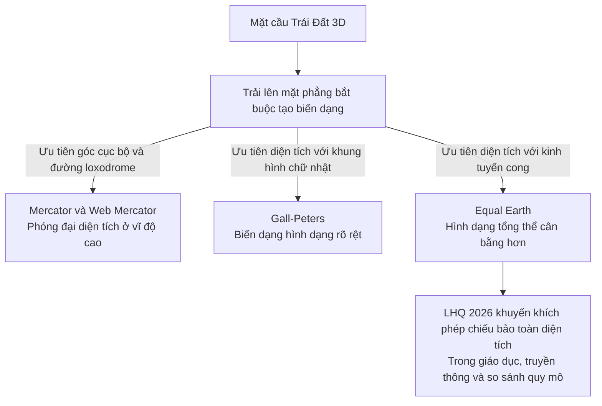

Equal Earth là phép chiếu bản đồ thế giới giả hình trụ bảo toàn diện tích (equal-area pseudocylindrical projection). Phép chiếu này giữ đúng tỷ lệ diện tích giữa các vùng khi đưa bề mặt Trái Đất lên bản đồ phẳng. So với một số phép chiếu bảo toàn diện tích hình trụ, Equal Earth được thiết kế để đường nét lục địa cân bằng và dễ nhận biết hơn.
![[Equal-Earth-Map.jpg]]
Ngày 4/9/2026, Đại hội đồng Liên Hợp Quốc thông qua dự thảo nghị quyết A/80/L.104. Nghị quyết khuyến khích sử dụng các phép chiếu bảo toàn diện tích khi cần so sánh quy mô lục địa và lãnh thổ, trong đó Equal Earth là một lựa chọn phù hợp. Văn bản không cấm Mercator, không coi Equal Earth là chuẩn duy nhất và không có tính ràng buộc pháp lý.

## 1. Nền tảng thiết kế và cơ chế toán học

Năm 2018, Bojan Šavrič của Esri, Tom Patterson của Cục Công viên Quốc gia Hoa Kỳ và Bernhard Jenny của Đại học Monash giới thiệu Equal Earth. Họ muốn tạo một bản đồ thế giới vừa bảo toàn diện tích, vừa có hình thức gần với phép chiếu Robinson vốn quen thuộc và dễ tiếp nhận. Khác với Equal Earth, Robinson không bảo toàn diện tích.

### Cơ chế bảo toàn diện tích

Với cùng một tỷ lệ thu nhỏ toàn cục, Equal Earth bảo toàn tỷ số diện tích giữa mọi cặp vùng:

$$
\frac{\text{Diện tích hình chiếu của vùng } A}{\text{Diện tích hình chiếu của vùng } B}
=
\frac{\text{Diện tích thực của vùng } A}{\text{Diện tích thực của vùng } B}
$$

Nếu vùng A có diện tích thực gấp 5 lần vùng B thì phần hình chiếu của A cũng có diện tích gấp 5 lần phần hình chiếu của B. Thuộc tính này không có nghĩa bản đồ chính xác tuyệt đối: hình dạng, khoảng cách và góc vẫn bị biến dạng.

### Cấu trúc giả hình trụ

- **Vĩ tuyến:** Là các đường thẳng nằm ngang song song. Khoảng cách giữa chúng thay đổi theo vĩ độ để duy trì điều kiện bảo toàn diện tích.
- **Kinh tuyến:** Kinh tuyến trung tâm là đường thẳng; các kinh tuyến còn lại uốn cong đối xứng về hai phía.
- **Hai cực:** Hai đoạn thẳng ngắn biểu diễn hai cực. Mercator không thể biểu diễn chính xác hai cực vì độ phóng đại tiến tới vô hạn.
- **Đường biên ngoài:** Đường cong gợi hình cầu giúp các lục địa ở rìa dễ nhận biết hơn so với nhiều phép chiếu bảo toàn diện tích hình chữ nhật.

### Sự đánh đổi không thể tránh khỏi

Theorema Egregium của Carl Friedrich Gauss cho thấy độ cong nội tại của một bề mặt được bảo toàn qua phép đẳng cự. Vì mặt cầu có độ cong Gaussian dương còn mặt phẳng có độ cong bằng 0, không thể trải mặt cầu lên mặt phẳng bằng một ánh xạ vừa liên tục vừa bảo toàn hoàn toàn khoảng cách cục bộ.

Trong thực hành bản đồ học, điều này dẫn đến sự đánh đổi giữa các thuộc tính:

1. Diện tích
2. Hình dạng và góc cục bộ
3. Khoảng cách
4. Phương hướng hoặc phương vị

Không có phép chiếu phẳng nào giữ chính xác tất cả các thuộc tính trên cho toàn thế giới. Equal Earth ưu tiên diện tích, đổi lại hình dạng, khoảng cách và góc bị biến dạng, đặc biệt ở rìa bản đồ và vùng vĩ độ cao.

## 2. So sánh kỹ thuật theo mục đích sử dụng

Không có một phép chiếu đúng nhất cho mọi tình huống. Lựa chọn hợp lý phụ thuộc vào thuộc tính cần bảo toàn và tác vụ của người dùng.

| Tiêu chí | Equal Earth | Mercator | Gall-Peters | Web Mercator | Địa cầu 3D |
|---|---|---|---|---|---|
| **Loại biểu diễn** | Giả hình trụ, bảo toàn diện tích | Hình trụ, đồng góc | Hình trụ, bảo toàn diện tích | Mercator cầu dùng cho bản đồ số | Mô hình bề mặt cong, không phải phép chiếu phẳng |
| **Thuộc tính ưu tiên** | Tỷ lệ diện tích và hình dạng tổng thể dễ nhận biết | Góc cục bộ và đường loxodrome | Tỷ lệ diện tích trong khung chữ nhật | Góc cục bộ, hệ tọa độ vuông và chia ô bản đồ | Quan hệ hình học trên bề mặt cầu |
| **Biến dạng chính** | Hình dạng, góc và khoảng cách ở rìa và vĩ độ cao | Diện tích tăng rất mạnh theo vĩ độ | Hình dạng bị kéo dọc gần xích đạo và kéo ngang ở vĩ độ cao | Giống Mercator và không hiển thị được hai cực | Hình ảnh trên màn hình chịu phối cảnh và chỉ thấy một phần bề mặt tại mỗi thời điểm |
| **Ứng dụng phù hợp** | Bản đồ thế giới và bản đồ chuyên đề cần so sánh diện tích | Bản đồ hàng hải truyền thống cần đường hướng không đổi | Bản đồ thế giới bảo toàn diện tích trong khung chữ nhật | Bản đồ web và di động cần kéo, thu phóng và tải theo ô | Ứng dụng tương tác để quan sát toàn cầu và quan hệ không gian quy mô lớn |

### Mercator: Đồng góc nhưng phóng đại diện tích

Gerardus Mercator giới thiệu phép chiếu mang tên ông năm 1569, chủ yếu để hỗ trợ hàng hải. Tính đồng góc (conformal) giúp bảo toàn góc cục bộ. Đường loxodrome, tức đường đi giữ nguyên hướng la bàn, được biểu diễn thành đường thẳng.

Trên mô hình cầu, tại vĩ độ $\varphi$:

- Hệ số tỷ lệ chiều dài của Mercator là $\sec\varphi$.
- Hệ số phóng đại diện tích là $\sec^2\varphi$.

Ví dụ, tại vĩ độ 60°, chiều dài bị phóng đại 2 lần và diện tích bị phóng đại 4 lần so với vùng gần xích đạo ở cùng tỷ lệ bản đồ. Độ phóng đại tiến tới vô hạn khi tiến gần hai cực, nên bản đồ Mercator phải cắt bỏ vùng cực.

Hai so sánh trực quan:

- **Châu Phi và Greenland:** Châu Phi rộng khoảng 30,37 triệu km², gấp hơn 14 lần Greenland với khoảng 2,16 triệu km². Trên nhiều bản đồ Mercator toàn cầu, hai vùng có thể trông gần tương đương.
- **Nam Mỹ và Hoa Kỳ:** Nam Mỹ rộng khoảng 17,8 triệu km², gần gấp đôi tổng diện tích Hoa Kỳ, nhưng khác biệt này khó nhận ra trên Mercator.

Tổng diện tích Hoa Kỳ, Trung Quốc, Ấn Độ và phần lớn Tây Âu nhỏ hơn hoặc xấp xỉ diện tích châu Phi. Đây chỉ là so sánh tổng diện tích, không cho thấy các lãnh thổ có thể được xếp nguyên hình dạng vào châu Phi mà không xoay, cắt hoặc chồng lấn.

### Gall-Peters: Bảo toàn diện tích trong khung chữ nhật

James Gall trình bày một phép chiếu hình trụ bảo toàn diện tích với hai vĩ tuyến chuẩn 45° vào năm 1855, rồi công bố mô tả chi tiết năm 1885. Năm 1973, Arno Peters độc lập phổ biến một phép chiếu tương đương và gắn nó với lập luận rằng bản đồ thế giới nên thể hiện đúng tỷ lệ diện tích của các nước đang phát triển. Tên gọi Gall-Peters ghi nhận cả hai người.

Gall-Peters bảo toàn diện tích nhưng tạo biến dạng hình dạng rõ rệt:

- Vùng gần xích đạo bị thu hẹp theo chiều ngang và kéo dài theo chiều dọc.
- Vùng vĩ độ cao bị kéo rộng theo chiều ngang và nén theo chiều dọc.

Equal Earth là một phương án bảo toàn diện tích dễ nhìn hơn Gall-Peters. Kinh tuyến cong và đường biên ngoài bo tròn giúp hình dạng các lục địa quen thuộc hơn. Hai phép chiếu phục vụ những lựa chọn trình bày khác nhau; Equal Earth không phải sự kế nhiệm chính thức của Gall-Peters.

### Web Mercator và địa cầu 3D trong công nghệ số

Web Mercator, thường được nhận diện bằng EPSG:3857, được dùng rộng rãi trong bản đồ số vì tạo hệ tọa độ vuông, thuận tiện cho việc chia thế giới thành các ô ở nhiều mức thu phóng. Phép chiếu này giữ góc cục bộ, nên một giao lộ chỉ hiện thành góc vuông nếu góc thực địa vốn là góc vuông. Tuy vậy, Web Mercator không phù hợp để so sánh diện tích giữa các vùng ở những vĩ độ khác nhau.

Google Maps và Apple MapKit sử dụng hệ tọa độ dựa trên Mercator cho bản đồ dạng ô và nhiều tác vụ tương tác. Ở quy mô lớn, một số giao diện hiện đại có thể chuyển sang địa cầu 3D hoặc chế độ ba chiều. Cách hiển thị này giảm biến dạng nội tại của bản đồ phẳng, nhưng hình ảnh trên màn hình vẫn chịu phối cảnh và không thể cho thấy toàn bộ bề mặt cùng lúc.

Equal Earth vẫn có thể xuất hiện trong ứng dụng tương tác, nhưng phù hợp nhất khi người xem cần quan sát toàn bộ thế giới và so sánh diện tích trong một khung hình. Với dẫn đường đường phố, tải ô bản đồ và thu phóng liên tục, Web Mercator thuận tiện hơn.

## 3. Nghị quyết Liên Hợp Quốc năm 2026

### Nội dung và địa vị pháp lý

Ngày 4/9/2026, Đại hội đồng Liên Hợp Quốc thông qua dự thảo nghị quyết A/80/L.104 mang tên *Correct the Map: Rebalancing global cartographic representation and promoting equitable representation of the world's regions, particularly Africa*.

- **Kết quả biểu quyết:** 164 phiếu thuận, 1 phiếu chống của Hoa Kỳ và 6 phiếu trắng của Estonia, Georgia, Lithuania, Moldova, Serbia và Ukraine.
- **Lực lượng khởi xướng:** Togo thay mặt Nhóm các quốc gia châu Phi giới thiệu dự thảo, với sự ủng hộ của Liên minh châu Phi.
- **Phạm vi:** Khuyến khích các chính phủ, cơ sở giáo dục, tổ chức quốc tế, truyền thông và doanh nghiệp công nghệ sử dụng các phép chiếu bảo toàn diện tích khi cần thể hiện tỷ lệ diện tích lục địa và lãnh thổ.
- **Giới hạn:** Không cấm Mercator, không áp đặt một phép chiếu duy nhất, không thay đổi biên giới và không tạo nghĩa vụ pháp lý bắt buộc.

### Ba lớp tranh luận cần phân biệt

#### 1. Công bằng nhận thức

Theo Nhóm châu Phi, bản đồ vừa truyền đạt tọa độ, vừa định hình trực giác về quy mô và vị thế của các khu vực. Khi Mercator trở thành bản đồ thế giới mặc định trong giáo dục, truyền thông và tài liệu công cộng, các vùng vĩ độ cao trông lớn hơn, còn châu Phi và nhiều khu vực nhiệt đới bị đánh giá thấp về quy mô tương đối.

Theo góc nhìn này, phổ biến các phép chiếu bảo toàn diện tích giúp nâng cao hiểu biết địa lý và giảm ảnh hưởng của một thiên kiến thị giác tồn tại lâu dài. Lập luận không cho rằng Mercator được tạo ra để phục vụ chủ nghĩa thực dân. Vấn đề là một công cụ tối ưu cho hàng hải lại trở thành hình ảnh mặc định để so sánh quy mô thế giới.

#### 2. Phản đối việc chính trị hóa công cụ kỹ thuật

Hoa Kỳ là quốc gia duy nhất bỏ phiếu chống. Đại diện Mỹ không phủ nhận việc Mercator làm sai tỷ lệ diện tích, nhưng phản đối cách nghị quyết gắn vấn đề này với công lý nhận thức, di sản thực dân và một chương trình nghị sự rộng hơn. Theo phía Mỹ, Đại hội đồng đang dành nguồn lực cho một nghị quyết mang tính biểu tượng thay vì các vấn đề hòa bình, thịnh vượng và quan hệ quốc tế.

#### 3. Phép chiếu toán học và dữ liệu biên giới chính trị

Phép chiếu quy định cách chuyển tọa độ từ bề mặt cong sang mặt phẳng. Một bản đồ hoàn chỉnh còn chứa dữ liệu đường biên, lãnh thổ tranh chấp, địa danh, màu sắc và các lựa chọn biên tập. Vì vậy cần phân biệt ba đối tượng:

1. **Phép chiếu Equal Earth:** Công thức toán học bảo toàn diện tích.
2. **Bản đồ dùng Equal Earth:** Sản phẩm kết hợp phép chiếu với một bộ dữ liệu địa lý và chính trị cụ thể.
3. **Trang equal-earth.com:** Nguồn phát hành bản đồ cụ thể, không đồng nhất với bản thân phép chiếu.

Ukraine và Serbia lo ngại về cách một số bản đồ liên quan đến Equal Earth thể hiện Crimea và các lãnh thổ tranh chấp. Liên minh châu Âu, Anh, Philippines, Pakistan và một số nước bỏ phiếu thuận cũng nhấn mạnh rằng nghị quyết không công nhận bất kỳ cách thể hiện biên giới cụ thể nào. Trong khi đó, Ấn Độ coi nghị quyết là sự ủng hộ dành cho nhóm phép chiếu bảo toàn diện tích nói chung; điều này không có nghĩa Equal Earth mặc nhiên trở thành phương pháp duy nhất.

Không nên quy lỗi về biên giới của một bản đồ cụ thể cho công thức phép chiếu. Ngược lại, ủng hộ một phép chiếu cũng không đồng nghĩa với công nhận mọi bản đồ được dựng bằng phép chiếu đó.

## 4. Cách chọn biểu diễn phù hợp

- **So sánh diện tích quốc gia, lục địa hoặc dữ liệu mật độ:** Dùng Equal Earth hoặc một phép chiếu bảo toàn diện tích phù hợp.
- **Bản đồ thế giới tổng quan không ưu tiên tuyệt đối một thuộc tính:** Có thể dùng phép chiếu thỏa hiệp như Robinson hoặc Winkel Tripel, nhưng phải chấp nhận diện tích không được bảo toàn chính xác.
- **Hàng hải với hướng la bàn không đổi:** Mercator vẫn có giá trị chuyên biệt.
- **Bản đồ web và di động cần kéo, thu phóng và chia ô:** Web Mercator có lợi thế hạ tầng và tính tương thích.
- **Quan sát tương tác toàn hành tinh:** Địa cầu 3D thể hiện quan hệ không gian tự nhiên hơn, nhưng không thay thế bản đồ phẳng trong mọi tác vụ.

Nên đánh giá phép chiếu theo mục đích sử dụng, thay vì xếp Mercator và Equal Earth vào hai nhóm đúng hoặc sai tuyệt đối. Equal Earth phù hợp hơn Mercator khi cần so sánh diện tích trên bản đồ thế giới phẳng. Với dẫn đường hoặc bản đồ tương tác, một lựa chọn khác có thể hợp lý hơn.

## Nguồn tham khảo

- [Dự thảo nghị quyết A/80/L.104 của Đại hội đồng Liên Hợp Quốc](https://docs.un.org/A/80/L.104)
- [Biên bản phiên họp toàn thể thứ 114, khóa 80 của Đại hội đồng Liên Hợp Quốc](https://transcripts.un.org/en/ga/80/114)
- [The Equal Earth map projection - International Journal of Geographical Information Science](https://doi.org/10.1080/13658816.2018.1504949)
- [Equal Earth projection - PROJ](https://proj.org/en/stable/operations/projections/eqearth.html)
- [Map and Tile Coordinates - Google Maps Platform](https://developers.google.com/maps/documentation/javascript/coordinates)
- [Displaying Maps - Apple MapKit](https://developer.apple.com/library/archive/documentation/UserExperience/Conceptual/LocationAwarenessPG/MapKit/MapKit.html)
- [Peters Projection - The History of Cartography, Volume 6](https://press.uchicago.edu/books/hoc/HOC_V6/HOC_VOLUME6_P.pdf)

## Liên kết liên quan

- [[Góc nhìn - Nhận thức, vị thế và cách gọi tên]] - Cơ chế đóng khung ngôn ngữ và hình ảnh (framing effect) định hình trực giác nhận thức của xã hội; xung đột vị thế giữa các chủ thể khi nhìn nhận cùng một hiện thực khách quan.
