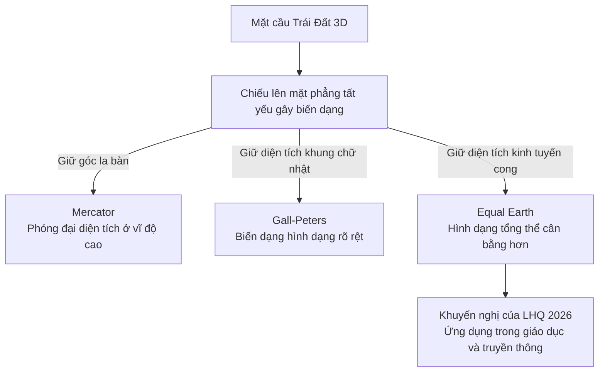

Equal Earth là phép chiếu giả hình trụ bảo toàn diện tích. Phép chiếu này giữ đúng tỷ lệ diện tích giữa các vùng khi đưa bề mặt Trái Đất lên bản đồ phẳng, đồng thời duy trì đường nét lục địa cân bằng, tự nhiên hơn so với các phép chiếu hình trụ bảo toàn diện tích trước đó. Phép chiếu này thu hút sự quan tâm toàn cầu sau khi Đại hội đồng Liên Hợp Quốc thông qua nghị quyết khuyến khích sử dụng các bản đồ bảo toàn diện tích trong giáo dục và truyền thông vào tháng 9/2026.
![[Equal-Earth-Map.jpg]]

## 1. Nguyên lý thiết kế

Năm 2018, nhóm nhà bản đồ học Bojan Šavrič, Tom Patterson và Bernhard Jenny giới thiệu phép chiếu Equal Earth. Họ muốn tạo một bản đồ thế giới vừa bảo toàn diện tích, vừa có hình thức thẩm mỹ hài hòa tương tự phép chiếu Robinson - một phép chiếu thỏa hiệp (compromise projection) từng rất phổ biến trong giáo dục và truyền thông nhờ thị giác cân đối, nhưng không bảo toàn diện tích.

### Cơ chế bảo toàn diện tích

Với cùng một tỷ lệ thu nhỏ toàn cục, Equal Earth bảo toàn tỷ số diện tích giữa mọi cặp vùng:

$$
\frac{\text{Diện tích hình chiếu của vùng } A}{\text{Diện tích hình chiếu của vùng } B}
=
\frac{\text{Diện tích thực của vùng } A}{\text{Diện tích thực của vùng } B}
$$

Nếu vùng A có diện tích thực gấp 5 lần vùng B thì phần hình chiếu của A cũng có diện tích gấp đúng 5 lần phần hình chiếu của B. Thuộc tính này không đồng nghĩa với việc bản đồ chính xác tuyệt đối: hình dạng, khoảng cách và góc vẫn bắt buộc bị biến dạng.

### Cấu trúc giả hình trụ

- **Vĩ tuyến:** Là các đường thẳng nằm ngang song song. Khoảng cách giữa chúng thay đổi theo vĩ độ để duy trì điều kiện bảo toàn diện tích.
- **Kinh tuyến:** Kinh tuyến trung tâm là đường thẳng; các kinh tuyến còn lại uốn cong đối xứng về hai phía.
- **Hai cực:** Hai đoạn thẳng ngắn biểu diễn hai cực, tránh độ phóng đại vô hạn ở vùng cực như trên Mercator.
- **Đường viền bo cong:** Hai mép biên uốn cong theo dáng quả địa cầu, giúp các vùng đất ở sát rìa không bị kéo bẹt như trên bản đồ hình chữ nhật.

### Sự đánh đổi không thể tránh khỏi

Về mặt toán học, nhà toán học Carl Friedrich Gauss từng chứng minh một nguyên lý bất biến: không có cách nào trải một mặt cầu lên mặt phẳng mà không làm biến dạng bề mặt. Nỗ lực đưa Trái Đất lên mặt phẳng cũng giống như cố ép dẹt một quả bóng: nó bắt buộc phải méo mó ở một khía cạnh nào đó. Trong bản đồ học, điều này dẫn đến sự đánh đổi không thể tránh khỏi giữa 4 thuộc tính cơ bản:

1. Diện tích
2. Hình dạng và góc cục bộ
3. Khoảng cách
4. Phương hướng hoặc phương vị

Trong sự đánh đổi đó, Equal Earth chọn bảo toàn diện tích làm ưu tiên cốt lõi, chấp nhận biến dạng hình dạng và khoảng cách ở vùng rìa lẫn vĩ độ cao. Rõ thấy nhất là ở hai cực: thay vì thu về một điểm như trên địa cầu, cả hai cực bị kéo thành hai đường thẳng nằm ngang, khiến lục địa Nam Cực bị dàn phẳng thành một dải dài dưới đáy bản đồ.

![[Mercato-vs-EqualEarth.jpg]]

## 2. So sánh kỹ thuật theo mục đích sử dụng

Không có một phép chiếu đúng nhất cho mọi tình huống. Lựa chọn hợp lý phụ thuộc vào thuộc tính cần ưu tiên và tác vụ của người dùng:

| Tiêu chí | Equal Earth | Mercator | Gall-Peters | Web Mercator | Địa cầu 3D |
|---|---|---|---|---|---|
| **Loại biểu diễn** | Giả hình trụ, bảo toàn diện tích | Hình trụ, đồng góc | Hình trụ, bảo toàn diện tích | Mercator cầu dùng cho bản đồ số | Mô hình bề mặt cong, không phải phép chiếu phẳng |
| **Thuộc tính ưu tiên** | Tỷ lệ diện tích và hình dạng tổng thể dễ nhận biết | Góc cục bộ và đường loxodrome | Tỷ lệ diện tích trong khung chữ nhật | Góc cục bộ, hệ tọa độ vuông và chia ô bản đồ | Quan hệ hình học trên bề mặt cầu |
| **Biến dạng chính** | Hình dạng, góc và khoảng cách ở rìa và vĩ độ cao | Diện tích tăng rất mạnh theo vĩ độ | Hình dạng bị kéo dọc gần xích đạo và kéo ngang ở vĩ độ cao | Giống Mercator và không hiển thị được hai cực | Hình ảnh trên màn hình chịu phối cảnh và chỉ thấy một phần bề mặt tại mỗi thời điểm |
| **Ứng dụng phù hợp** | Bản đồ thế giới và bản đồ chuyên đề cần so sánh diện tích | Bản đồ hàng hải truyền thống cần đường hướng không đổi | Bản đồ thế giới bảo toàn diện tích trong khung chữ nhật | Bản đồ web và di động cần kéo, thu phóng và tải theo ô | Ứng dụng tương tác để quan sát toàn cầu và quan hệ không gian quy mô lớn |

### Mercator: Đồng góc nhưng phóng đại diện tích

Gerardus Mercator công bố phép chiếu mang tên ông năm 1569 nhằm phục vụ hàng hải. Tính đồng góc (conformal) giúp bảo toàn góc cục bộ, biến đường loxodrome (đường giữ nguyên góc la bàn) thành đường thẳng.

Trên mô hình cầu, tại vĩ độ $\varphi$:
- Hệ số tỷ lệ chiều dài là $\sec\varphi$.
- Hệ số phóng đại diện tích là $\sec^2\varphi$.

Tại vĩ độ 60°, diện tích bị phóng đại gấp 4 lần so với vùng xích đạo ở cùng tỷ lệ, và tiến tới vô hạn khi tiếp cận hai cực. Sự phóng đại này tạo ra những sai lệch thị giác điển hình:

- **Châu Phi và Greenland:** Châu Phi (~30,37 triệu km²) rộng gấp hơn 14 lần Greenland (~2,16 triệu km²). Trên bản đồ Mercator, hai vùng này lại trông gần tương đương nhau. Trên thực tế, diện tích châu Phi đủ sức chứa toàn bộ Hoa Kỳ, Trung Quốc, Ấn Độ và phần lớn Tây Âu gộp lại.
- **Việt Nam và các nước châu Âu:** Việt Nam (~331.000 km²) nằm gần xích đạo nên gần như giữ nguyên kích thước thực tế (độ giãn dưới 10%). Ngược lại, các quốc gia châu Âu ở vĩ độ cao bị phóng đại rất lớn: Đức (~357.000 km²) chỉ nhỉnh hơn Việt Nam 8% nhưng hiện to gấp 2,5 lần; Phần Lan (~338.000 km²) và Na Uy bị phóng to gấp 4-5 lần; trong khi Vương quốc Anh (~243.000 km²), Ý (~301.000 km²) hay Ba Lan (~312.000 km²) thực tế đều nhỏ hơn Việt Nam.

### Quy mô diện tích thực tế giữa các lục địa

Bảng đối chiếu quy mô thực tế khi loại bỏ hiệu ứng phóng đại vĩ độ của Mercator:

| Lục địa / Vùng lãnh thổ        | Diện tích thực tế (triệu km²) | Tỷ lệ so với châu Phi | Đặc điểm trên Mercator                           | Đặc điểm trên Equal Earth                                    |
| ------------------------------ | ----------------------------- | --------------------- | ------------------------------------------------ | ------------------------------------------------------------ |
| **Châu Á**                     | ~44,6                         | ~1,47x                | Phần Bắc Á và Siberia bị kéo giãn cực mạnh       | Thể hiện đúng quy mô lục địa lớn nhất thế giới               |
| **Châu Phi**                   | ~30,4                         | 1,00x                 | Bị thu nhỏ tương đối so với Bắc bán cầu          | Trung tâm bảo toàn diện tích, lớn gần gấp 3 lần châu Âu      |
| **Bắc Mỹ**                     | ~24,7                         | ~0,81x                | Phóng đại mạnh ở Canada và Alaska                | Trở về đúng quy mô, nhỏ hơn đáng kể so với châu Phi          |
| **Nam Mỹ**                     | ~17,8                         | ~0,59x                | Bị đánh giá thấp trong tương quan với Bắc Mỹ     | Lớn gần gấp đôi Hoa Kỳ, bằng ~59% diện tích châu Phi         |
| **Nam Cực**                    | ~14,2                         | ~0,47x                | Bị cắt bỏ hoặc kéo giãn thành dải vô tận ở đáy   | Thể hiện đúng diện tích lục địa bao quanh cực Nam            |
| **Châu Âu (địa lý)**           | ~10,2                         | ~0,34x                | Phóng đại gấp nhiều lần so với thực tế vĩ độ cao | Quy mô thực chỉ bằng khoảng 1/3 diện tích châu Phi           |
| **Australia (châu Đại Dương)** | ~7,7                          | ~0,25x                | Ít biến dạng ở phía bắc, giãn nhẹ phía nam       | Thể hiện đúng tương quan quy mô (châu Phi chứa ~4 Australia) |
| **Greenland (đảo)**            | *~2,16*                       | *~0,07x*              | Bị phóng đại tương đương châu Phi (gấp ~14 lần)  | Thu nhỏ về đúng tỷ lệ diện tích đảo (1/14 châu Phi)          |

### Gall-Peters: Bảo toàn diện tích trong khung chữ nhật

James Gall mô tả phép chiếu hình trụ bảo toàn diện tích với hai vĩ tuyến chuẩn 45° vào các năm 1855 và 1885. Năm 1973, Arno Peters độc lập phổ biến một phép chiếu tương đương nhằm ủng hộ quyền bình đẳng thị giác cho các nước đang phát triển.

Gall-Peters giữ đúng diện tích nhưng gây méo mó hình dạng nghiêm trọng: vùng xích đạo bị kéo giãn mạnh theo chiều dọc và nén ngang, còn vùng cực bị kéo dẹt ngang. Equal Earth ra đời như một giải pháp thay thế trực quan hơn: vẫn bảo toàn diện tích nhưng nhờ sử dụng các kinh tuyến cong nên hình dạng các lục địa tự nhiên và cân đối hơn nhiều.

### Bài toán bản đồ số: Web Mercator và mô hình Địa cầu 3D

Web Mercator (EPSG:3857) thống trị các nền tảng bản đồ số như Google Maps hay Apple MapKit nhờ hệ tọa độ vuông phẳng, cho phép chia thế giới thành các ô lưới (tile matrix) đồng nhất để tải và phóng to thu nhỏ mượt mà. Tuy nhiên, Web Mercator kế thừa toàn bộ nhược điểm phóng đại diện tích của Mercator truyền thống.

Ở quy mô toàn cầu, các ứng dụng số hiện đại thường chuyển sang mô hình Địa cầu 3D để giảm thiểu biến dạng phẳng. Dù vậy, địa cầu 3D chỉ hiển thị được một bán cầu tại mỗi thời điểm và chịu hiệu ứng phối cảnh màn hình. Do đó, Equal Earth vẫn là công cụ tối ưu khi người xem cần so sánh diện tích toàn cầu đồng thời trong một khung nhìn phẳng duy nhất.

## 3. Nghị quyết Liên Hợp Quốc năm 2026

### Nội dung và địa vị pháp lý

Ngày 4/9/2026, Đại hội đồng Liên Hợp Quốc thông qua dự thảo nghị quyết A/80/L.104 mang tên *Correct the Map: Rebalancing global cartographic representation and promoting equitable representation of the world's regions, particularly Africa*.

- **Kết quả biểu quyết:** 164 phiếu thuận, 1 phiếu chống của Hoa Kỳ và 6 phiếu trắng của Estonia, Georgia, Lithuania, Moldova, Serbia và Ukraine.
- **Lực lượng khởi xướng:** Togo đại diện cho Nhóm các quốc gia châu Phi đề xuất, với sự đồng thuận của Liên minh châu Phi (AU).
- **Phạm vi và giới hạn:** Khuyến khích các chính phủ, trường học, cơ quan truyền thông và công ty công nghệ ưu tiên các phép chiếu bảo toàn diện tích khi so sánh quy mô lãnh thổ. Nghị quyết không mang tính ràng buộc pháp lý, không cấm Mercator và không áp đặt bất kỳ biên giới quốc gia nào.

### Ba lớp tranh luận cần phân biệt

#### 1. Thiên kiến thị giác và tâm lý quyền lực

Bản đồ không thuần túy là công cụ hình học; cách thể hiện không gian tác động trực tiếp đến nhận thức về vị thế và quyền lực giữa các khu vực:

- **Thói quen thị giác suốt bốn thế kỷ:** Suốt hơn bốn thế kỷ, Mercator là hình ảnh bản đồ duy nhất được treo trong trường học và xuất hiện trên truyền thông. Khi không có bản đồ đối chứng, sự sai lệch kích thước dần được xã hội tiếp nhận như một thực tế hiển nhiên.
- **Ảo giác về quy mô và quyền lực:** Trực giác thị giác thường coi cái gì to hơn và nằm ở trên là quan trọng hơn. Sự phóng đại của Mercator ở Bắc bán cầu vô tình thổi phồng vị thế của phương Tây, trong khi thu nhỏ các quốc gia nhiệt đới và Nam bán cầu dưới mức thực tế.
- **Tác động lâu dài:** Chuyển sang các phép chiếu bảo toàn diện tích trong giáo dục không làm thay đổi đường biên giới và tốn rất ít chi phí, nhưng giúp các thế hệ tương lai có cái nhìn công bằng và thực tế hơn về quy mô thế giới.

#### 2. Toan tính kinh tế - pháp lý của Hoa Kỳ

Hoa Kỳ là quốc gia duy nhất bỏ phiếu chống trong số 171 nước tham gia, xuất phát từ nỗi lo về một chuỗi tiền lệ pháp lý:

- **Nỗi lo tiền lệ bồi thường thuộc địa:** Về toán học, Mỹ không phủ nhận Mercator bóp méo diện tích. Nhưng Washington lo ngại nghị quyết này là bước đệm cho các yêu sách bồi thường thời kỳ thuộc địa (vốn đang được Liên minh châu Phi đẩy mạnh). Nếu thừa nhận bản đồ cũ làm sai lệch vị thế lịch sử của châu Phi, phương Tây sẽ tự tạo ra tiền lệ pháp lý để các nước này đòi bồi thường tài chính sau này. Bỏ phiếu chống là cách Mỹ chặn đứng chuỗi yêu sách từ bước đầu tiên.
- **Thế kẹt của 6 phiếu trắng:** Sáu quốc gia bỏ phiếu trắng (Ukraine, Estonia, Lithuania, Georgia, Moldova, Serbia) đều có những ràng buộc chiến lược riêng: họ vừa chịu sức ép không đi ngược lại lập trường của Mỹ và các đồng minh phương Tây, vừa cực kỳ thận trọng trước bất kỳ tiền lệ nào có thể ảnh hưởng đến các tranh chấp chủ quyền và toàn vẹn lãnh thổ của chính mình.

#### 3. Tách biệt công thức toán học và dữ liệu biên giới

Tranh cãi ngoại giao quanh nghị quyết thường xuất phát từ sự nhầm lẫn giữa công thức toán học và dữ liệu địa chính trị:

- **Phép chiếu toán học:** Bản chất của Equal Earth chỉ là công thức toán học chuyển đổi tọa độ từ mặt cầu lên mặt phẳng nhằm bảo toàn diện tích. Công thức này hoàn toàn trung lập, không chứa thông tin chính trị hay chủ quyền.
- **Lớp dữ liệu biên giới:** Khi một đơn vị xuất bản bản đồ (chẳng hạn trang web `equal-earth.com`), họ phải chọn một bộ dữ liệu địa lý cụ thể để vẽ đường ranh giới và gắn nhãn địa danh. Một số bản đồ Equal Earth thể hiện khu vực Crimea theo thực tế kiểm soát (de facto) đã vấp phải phản ứng từ Ukraine và Serbia.
- **Nguyên tắc tách bạch:** Khi bỏ phiếu thuận, các bên như phái đoàn EU, Anh, Ấn Độ, Philippines hay Pakistan đều tuyên bố rõ ràng: ủng hộ phép chiếu bảo toàn diện tích không đồng nghĩa với công nhận cách thể hiện biên giới của bất kỳ bản đồ cụ thể nào. Không thể quy lỗi ranh giới chính trị cho công thức toán học, và áp dụng phép chiếu cũng không hợp thức hóa bất kỳ yêu sách lãnh thổ nào.

## Nguồn tham khảo

- [Dự thảo nghị quyết A/80/L.104 của Đại hội đồng Liên Hợp Quốc](https://docs.un.org/A/80/L.104)
- [Biên bản phiên họp toàn thể thứ 114, khóa 80 của Đại hội đồng Liên Hợp Quốc](https://transcripts.un.org/en/ga/80/114)
- [The Equal Earth map projection - International Journal of Geographical Information Science](https://doi.org/10.1080/13658816.2018.1504949)
- [Equal Earth projection - PROJ](https://proj.org/en/stable/operations/projections/eqearth.html)
- [Map and Tile Coordinates - Google Maps Platform](https://developers.google.com/maps/documentation/javascript/coordinates)
- [Displaying Maps - Apple MapKit](https://developer.apple.com/library/archive/documentation/UserExperience/Conceptual/LocationAwarenessPG/MapKit/MapKit.html)
- [Peters Projection - The History of Cartography, Volume 6](https://press.uchicago.edu/books/hoc/HOC_V6/HOC_VOLUME6_P.pdf)

